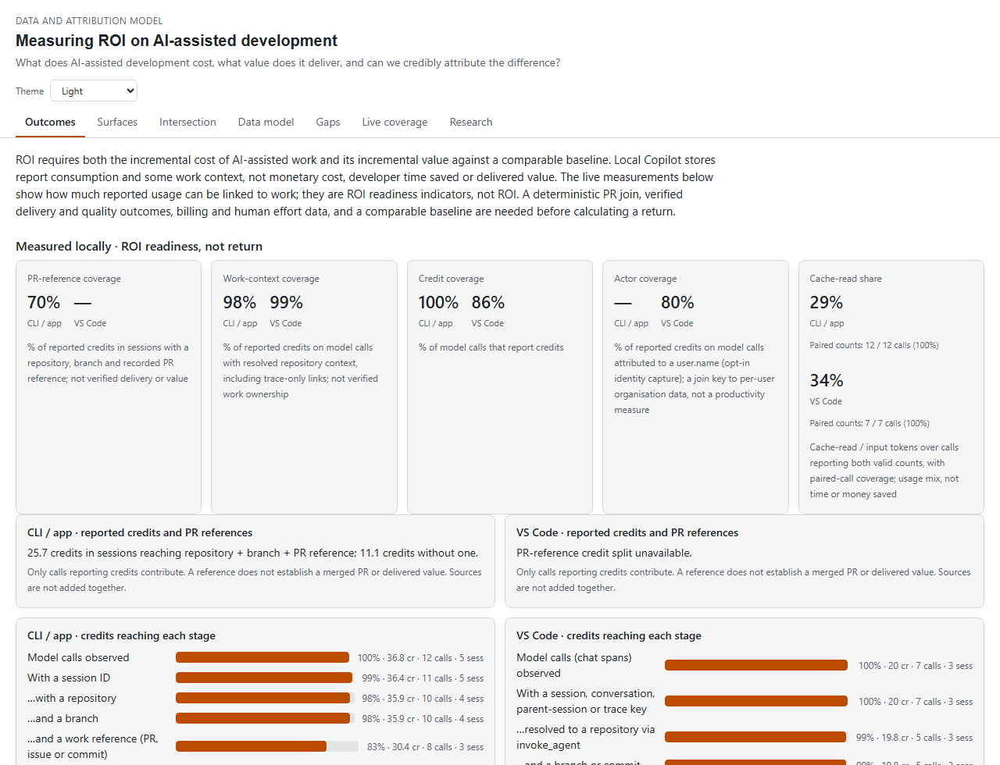
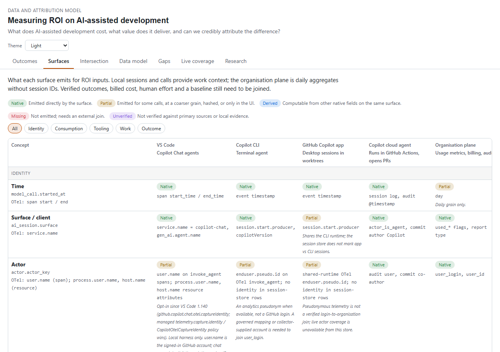
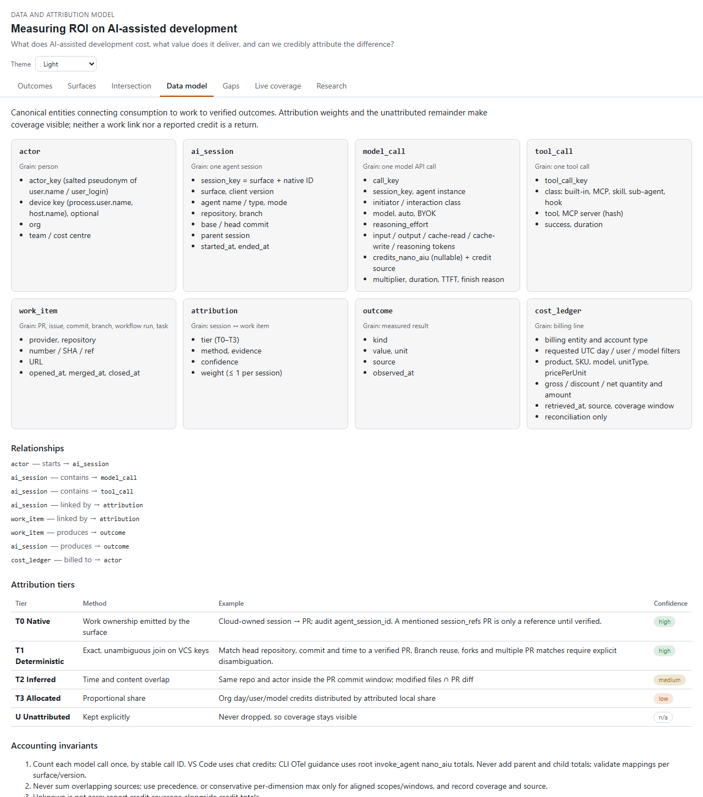
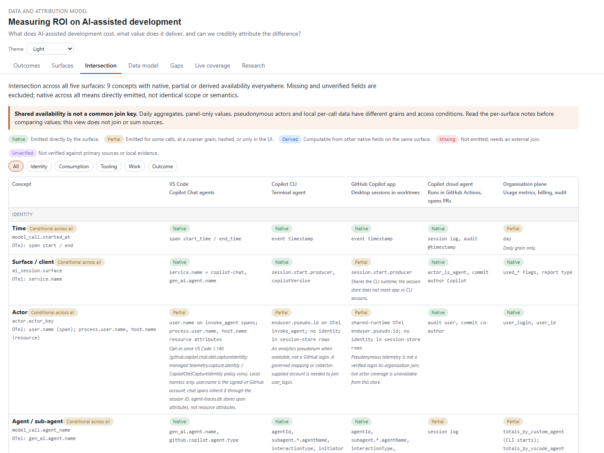
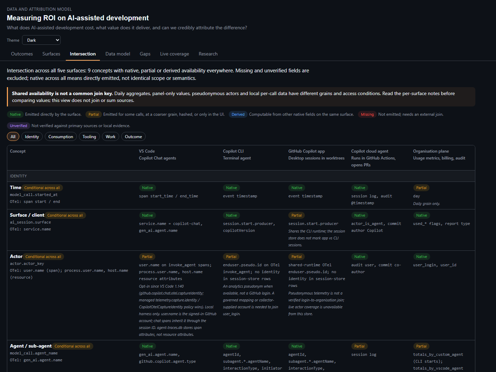

# AI attribution canvas

A [GitHub Copilot app](https://docs.github.com/en/copilot/how-tos/github-copilot-app/agent-sessions)
canvas for Data and Attribution Model. It examines what is
needed to measure ROI on AI-assisted development across VS Code, Copilot CLI,
the Copilot app and the cloud agent. Live local measurements show reported
usage and work-link coverage, not monetary ROI or proven value.

It renders [the research](../../../docs/research/ai-telemetry-attribution.md) and
[the model spec](../../../docs/research/attribution-model.json), and adds live,
read-only coverage from this machine.



The screenshots in this document are generated by `npm run media:canvas` from
synthetic session and trace stores, so they never read live Copilot databases.

## Views

| Tab | Shows |
| --- | --- |
| Outcomes | ROI-readiness metrics, reported credits with/without a PR reference, and the cost, value and baseline inputs still needed |
| Surfaces | Concept × surface matrix with native / partial / missing / unverified fields |
| Intersection | Verified concepts available across all five surfaces, with native vs conditional availability and each source's grain/access caveats |
| Data model | Entities, relationships, attribution tiers and accounting invariants |
| Gaps | Gaps by impact, verification status and prior art |
| Live coverage | Per-source funnel, breakdowns by model, agent, reasoning effort, repository, user and tools |
| Research | The rendered research document and sources |





## Live coverage

| Source | Default location |
| --- | --- |
| Copilot CLI / app session store | `$COPILOT_HOME/session-store.db` (default `~/.copilot/`) |
| VS Code span store | `globalStorage/github.copilot-chat/agent-traces.db` for Code and Code - Insiders |

Stores are opened read-only. If the file is locked, a temporary copy is read and
then deleted. Only aggregates are produced (counts, token and credit sums, and
model, agent, tool, repository and user names); prompt, response and tool content is
never read. Nothing leaves the machine, and the two sources are shown side by
side rather than summed.

### Reading coverage and token values

Repository and user context use the latest matching agent span **at or before**
each model call, through session, conversation, parent-session or trace keys.
Trace-only calls contribute to repository coverage and the breakdown but do
not create sessions. CLI/app repository and branch still come from the current
session row; that store does not version historical work context.

Token values are **reported subtotals**, with a per-field reporting-call count.
No reports displays `—`, not zero; a reported zero is still zero. Cache-read
share divides cache-read by input tokens only on calls reporting both valid
counts (cache cannot exceed input), and shows that paired-call coverage.
Partial reasoning or cache subtotals must not be treated as complete usage.

The surface matrix describes source capabilities, not everything ingested by
this canvas. Organisation reports include daily CLI/app tokens and partial
skill, plugin, custom-agent and MCP aggregates; MCP counts connections, not
tool calls. Task-completion events are self-reports, not correctness signals.
The **Data model** tab carries the billing reconciliation contract: preserve
query scope, compare matching gross AI-credit consumption, and keep discounts,
net billed amounts and T3 allocations separate. Billing is not connected here.

### Intersection

The **Intersection** tab derives concepts available across VS Code, CLI, app,
cloud agent and organisation data from the model. Every cell must be native,
partial or derived; missing and unverified fields are excluded. Native across
all means directly emitted, not equivalent grain or comparable values.
Conditional across all includes opt-in, daily aggregates and panel-only data.
It does not join or sum sources.



### Theme

**App / system** uses the documented host theme tokens and color mode when
available, otherwise the system light/dark preference. It follows live theme
changes. The **Theme** selector can explicitly choose Light or Dark for the
current page; reloading returns to App / system. No app-internal tokens are
required.



### User attribution

VS Code 1.140 can add the signed-in GitHub account to Copilot telemetry as
`user.name` on agent invocation spans
([identity capture](https://code.visualstudio.com/updates/v1_140#_capture-user-identity-in-opentelemetry),
`github.copilot.chat.otel.captureIdentity`, off by default). The VS Code source
resolves each model call's user from its own `user.name`, else from the latest
agent span at or before the call in the same chat session, conversation, parent
session or trace. It reports the share of credits attributed to a user
(**Actor coverage**) and a **By user** breakdown. `process.user.name` and
`host.name` are resource attributes, which `agent-traces.db` does not store.
The CLI / app session store records no user, so its actor coverage is not
measured. This user name is the join key to organisation data keyed by
`user_login`; pseudonymise it before it leaves the machine.


## Use

The app loads project extensions from `.github/extensions/`. Ask Copilot to open
the **AI attribution** canvas, or have the agent call:

```text
open_canvas({ canvasId: "ai-attribution", instanceId: "attribution", input: { view: "outcomes", windowDays: 30 } })
```

| Action | Input | Result |
| --- | --- | --- |
| `show_view` | `{ view }` | Switches tab |
| `refresh_coverage` | `{ windowDays? }` | Recomputes coverage; returns a summary |
| `get_coverage` | — | Full coverage object |
| `get_model` | `{ section? }` | Model spec or one section |

Open input also accepts `sessionStorePath` and `tracesDbPath` overrides.

## Layout

| File | Role |
| --- | --- |
| `extension.mjs` | Canvas declaration, actions and per-panel state |
| `lib/coverage.mjs` | Store discovery and coverage computation |
| `lib/server.mjs` | Loopback HTTP server, JSON API and server-sent events |
| `lib/model.mjs` | Loads the committed research files |
| `ui/` | Static front end (no build step, no dependencies) |

After editing, reload extensions in the app. Tests live in
[`test/attributionCanvas.test.js`](../../../test/attributionCanvas.test.js).

## Reuse

This folder is committed, so the GitHub Copilot app loads the canvas for anyone
who opens this repository. To build another canvas from it:

| Part | Reuse as |
| --- | --- |
| `lib/server.mjs` | Generic per-panel loopback server: static files, JSON API, server-sent events, and Host/Origin checks against DNS rebinding and cross-site posts. Pass your own `uiDir` and `api`. |
| `ui/dom.js`, `ui/markdown.js` | Safe rendering: nodes built with text only, never HTML strings; links limited to `http(s)`. |
| `lib/coverage.mjs` | Read-only access to the Copilot session store and VS Code `agent-traces.db`, with a temporary-copy fallback when a database is locked. |
| `extension.mjs` | Pattern for a canvas with an input schema, validated actions and cleanup on close. |

Copy the folder to `.github/extensions/<name>/` (shared with the repository) or
`~/.copilot/extensions/<name>/` (personal), then change the canvas `id`,
`displayName` and views. `lib/model.mjs` reads `docs/research/` relative to the
repository root; point `MODEL_PATH` and `RESEARCH_PATH` elsewhere when the
extension lives outside this repository.

To share without copying files, use **Share extension as gist…** in the app's
command palette and **Install extension from gist…** on the other side. The app
can also install straight from this folder's GitHub URL.
