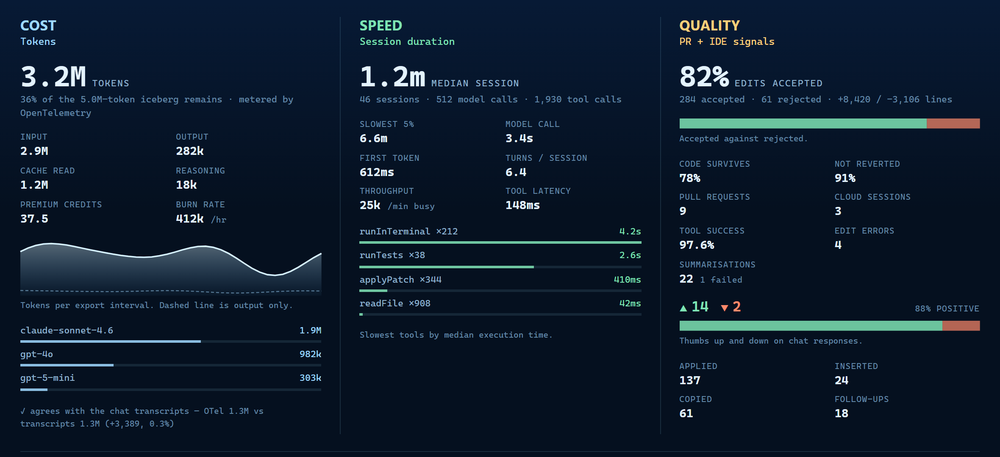

# 🐻‍❄️ Bear in Mind — Copilot Token Meter

**Every token you burn melts the bear's home.** Track Copilot usage in your
sidebar, with a dashboard for tokens, speed and quality.

[](https://github.com/obrocki/bear-in-mind/actions/workflows/ci.yml)
[](LICENSE)

Bear in Mind visualises usage. **It cannot cap spending, throttle requests or
change your bill**, including on unlimited plans.


## Install

Download a `.vsix` from [Releases](https://github.com/obrocki/bear-in-mind/releases),
then run:

```bash
code --install-extension bear-in-mind-0.5.1.vsix
```

Use the downloaded filename if it differs. Open the Iceberg activity-bar icon.
Every merge also updates the rolling
[`dev` build](https://github.com/obrocki/bear-in-mind/releases/tag/dev).

## The dashboard

Open **Iceberg: Open Token Dashboard** or the sidebar's *Cost, Speed, Quality* view.



| Section | Signals |
| --- | --- |
| Cost | Input/output tokens by model, cache/reasoning tokens, premium credits and burn rate. Not a currency bill. |
| Speed | Session and model-call durations, first-token latency, turns and slowest tools. |
| Quality | Edit acceptance, code survival, pull requests, tool success and response feedback. |

The ice shows **context-window headroom** when a recent trace reports it;
otherwise it shows cumulative usage against `iceberg.tokenBudget` (default 5M).
The label identifies the mode. Missing signals stay empty rather than implying zero.

## Connecting the telemetry

Run **Iceberg: Connect Copilot Telemetry…**, choose a source, **reload the window,
then send a Copilot Chat request**. Allow an export interval for data to arrive.

| Source | Provides | Exporter impact |
| --- | --- | --- |
| Local trace store (`agent-traces.db`) | Exact timings, context limits and span token details. | Runs alongside an existing OTLP collector. |
| JSON-lines file feed | Token metrics and quality signals. | **Replaces the OTLP exporter.** The command warns first. |
| Both | All available signals. | Same replacement caveat as the file feed. |

File-feed spans may serialize as `{}` with OpenTelemetry JS SDK v2; exact span
timings need the trace store. Quality needs relevant actions, not just chat
requests: accept/reject an edit or rate a response. A connected but empty Quality
section [waits for those signals](docs/media/dashboard-waiting.png); it does not
require reconnecting.

## How tokens get counted

Existing history becomes a baseline. Watchers charge only growth and persist
their accounting across restarts. Automatic input/output totals use
`max(telemetry, transcripts)` per dimension, **not their sum**; premium credits
come from transcripts. Manual API reports are added separately.

**Handover is approximate.** The sources share no request ID. At each telemetry
promotion, recent transcript usage estimates overlap, capped at that first
delta. Unrelated recent traffic can be absorbed; later `max()` reconciliation
does not guarantee recovery. Treat totals as usage estimates, not billing records.

Metering stays local. See [SECURITY.md](SECURITY.md) for data handling.

## API

The exported API and `iceberg.report` command share one implementation and accept
`{ input?, output? }`. A numeric argument remains supported as input tokens.
Report only usage the automatic watchers do **not** already see.

```ts
const extension = vscode.extensions.getExtension('obrocki.bear-in-mind');
const api = await extension?.activate();
api?.reportUsage({ input: 1200, output: 340 });

// Or use the command instead of reportUsage:
// await vscode.commands.executeCommand('iceberg.report', { input: 1200, output: 340 });
```

| Member | Contract |
| --- | --- |
| `reportUsage(usage)` | Adds a report; missing fields are zero. Non-positive/non-finite values are ignored; positive values are rounded. |
| `getUsage()` | Current totals, budget, `health` (0–1), source, melt basis, context and drift. |
| `onDidChangeUsage(listener)` | Usage snapshots; returns a disposable subscription. |

Types: [`IcebergApi`, `UsageReport`, `UsageSnapshot`](src/api.ts).
`@iceberg` chat and the meltdown demo also add usage separately.

## Commands and settings

Search the Command Palette for **Iceberg** to open the habitat/dashboard, connect
telemetry, inspect diagnostics/stats, name the bear or toggle the meltdown demo.

Common settings:

| Setting | Default | Purpose |
| --- | --- | --- |
| `iceberg.tokenBudget` | `5000000` | Budget-mode denominator. |
| `iceberg.trackCopilotChat` | `true` | Read transcript token counts and credits. |
| `iceberg.otel.enabled` | `true` | Read local telemetry. |
| `iceberg.otel.authoritative` | `true` | Include new telemetry usage in the meter; off makes it display-only. |
| `iceberg.otel.feedPath` | `""` | Override the feed path; otherwise follow Copilot's configuration. |
| `iceberg.otel.tracesDbPath` | `""` | Override trace-store discovery. |

Use **Settings → Iceberg** for polling, input/output counting, animation, pixel
scale, status bar and bear name. Turning telemetry off does not erase counted usage.

## Troubleshooting

- **No data:** reload after connecting, send a chat request, then run
  **Iceberg: Telemetry Diagnostics**. Check **View → Output → Iceberg**.
  Transcript metering requires a VS Code build that records token counts (1.130+).
- **Quality is empty:** an active feed can have token data before any quality
  actions occur. Trace-store-only setups need a file feed.
- **Collector stopped:** clear `github.copilot.chat.otel.outfile` to restore OTLP;
  use the local trace store alongside it.
- **Duplicate menus:** remove old `local.iceberg-copilot` or
  `obrocki.iceberg-copilot` installs, then reload. `iceberg.*` settings remain valid.

## Development

```bash
npm ci
npm test
npm run vsix
```

The VSIX build typechecks, bundles and verifies the archive. Press `F5` for an
Extension Development Host. See [CONTRIBUTING.md](CONTRIBUTING.md) for architecture,
accounting invariants and release steps.

[MIT](LICENSE) © Dawid Obrocki
