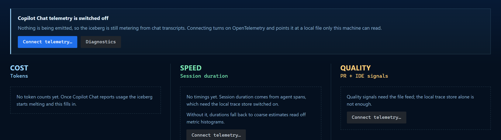

# 🐻‍❄️ Bear in Mind — Copilot Token Meter

**A polar bear lives in your sidebar. Every token you burn melts its home.**

[](https://github.com/obrocki/bear-in-mind/actions/workflows/ci.yml)
[](https://github.com/obrocki/bear-in-mind/actions/workflows/build-vsix.yml)
[](LICENSE)
[](https://code.visualstudio.com/)
[](CONTRIBUTING.md)

---

Bear in Mind turns Copilot's token consumption into something you can feel. It
watches what you burn and shrinks a hand-drawn arctic scene to match. Nothing to
configure and nothing to enter — just a bear with progressively less to stand on.
When you want the actual numbers, there is
[a dashboard](#the-dashboard) for cost, speed and quality.

> [!NOTE]
> **Bear in Mind has no enforcement mechanism.** It cannot cap your spend,
> throttle a request, block a prompt, or change your bill in any way. It only
> makes the burn visible. The entire mechanism is compassion for the polar bear —
> you see its home shrinking, and you think twice about the next 40k-token agent
> run. That is the whole product, and it is why it is called what it is. If your
> plan is unmetered, the counter still climbs and the ice still melts; the bear
> does not know or care about your billing tier.


*The full melt, and a refreeze. Roughly 5 million tokens compressed into eight seconds.*

## The melt

The iceberg's width, height, and the strip of ice the bear can walk on all scale
with how much room you have left. So does everything else in the scene.


| Ice remaining | What happens |
| --- | --- |
| **100–70%** | Polar night. Aurora overhead, stars, a calm sea. The bear roams the full ridge. |
| **70–40%** | The sky warms toward sunset. The berg loses height first, then width. Cracks start to show. |
| **40–15%** | Amber and red. Chunks calve off into the water, meltwater drips, the bear's walkable strip narrows to a few tiles. |
| **15–1%** | Scorched sky. A floe barely wider than the bear. It stops roaming and starts shivering. |
| **0%** | `THE ICE IS GONE`. |

### What the ice measures

Whichever of these the telemetry can tell it:

- **Context window headroom** — how much of the model's context window the
  current session is using, from `copilot_chat.request.max_prompt_tokens` against
  the prompt size. This is the default whenever it is available. It needs no
  configuring, it climbs through an agent turn as context accumulates, and it
  refreezes on its own when a session ends or the context is summarised.
- **Cumulative burn against `iceberg.tokenBudget`** — the fallback, used until
  the [trace store](#connecting-the-telemetry) is connected. Lifetime tokens
  against a fixed 5M default.

The panel always says which one you are looking at, so a bare percentage is never
ambiguous.

## The dashboard

The iceberg answers *how much room is left*. The dashboard answers *why*.


| Section | Measures | Shows |
| --- | --- | --- |
| **Cost** | Tokens | Input, output, cache-read and reasoning tokens split by model, premium credits, burn rate, and burn over time. |
| **Speed** | Session duration | Median and 95th-percentile session length, model call latency, time to first token, turns per session, slowest tools. |
| **Quality** | PR + IDE signals | Edit accept/reject, lines added and removed, how much generated code survives, pull requests, tool success rate, thumbs up/down, and what you did with responses. |

Open it with **Iceberg: Open Token Dashboard**, or from the *Cost, Speed,
Quality* view in the sidebar. Any section without data says so and names the
signal it is waiting for, rather than showing a confident zero.

## Install

Grab the `.vsix` from the [latest release](https://github.com/obrocki/bear-in-mind/releases):

```bash
code --install-extension bear-in-mind-*.vsix
```

Every merge to `main` also refreshes the rolling
[`dev` pre-release](https://github.com/obrocki/bear-in-mind/releases/tag/dev).
Or build it yourself with `npm install && npm run vsix`, or press `F5` for an
Extension Development Host.

Then open the 🧊 icon in the activity bar.

| The sidebar panel | **Iceberg: Open Habitat in Editor** |
| --- | --- |
|  |  |

## Connecting the telemetry

Copilot Chat can emit traces, metrics and events over
[OpenTelemetry](https://github.com/microsoft/vscode-copilot-chat/blob/main/docs/monitoring/agent_monitoring.md),
following the GenAI semantic conventions. It is **off by default**. Run
**Iceberg: Connect Copilot Telemetry…** and pick a source:

| Source | Unlocks | Cost |
| --- | --- | --- |
| **Local trace store** — `agent-traces.db` | Sections 01 and 02, exact session timings, and context-window headroom. | None. It registers an *extra* span processor, so it runs alongside any OTLP collector you already use. |
| **File feed** — a JSON-lines file | All three sections. Only this carries the log records section 03 needs. | It **replaces** your exporter. Setting `outfile` forces `exporterType` to `file`, so a collector you were exporting to stops receiving data. |
| **Both** | Everything. | Same caveat as the file feed. |

The command warns before replacing anything and never changes an exporter
silently. Reload the window afterwards so Copilot Chat picks it up.



Everything stays on your machine — both sources are local files, and Bear in Mind
has no network access.

### What gets captured, and from where

Bear in Mind reads numbers and labels only. It never reads prompt or response
text, even when `captureContent` puts it in the feed.

| Signal | Instrument | Source | Used for |
| --- | --- | --- | --- |
| Prompt / completion tokens | `gen_ai.client.token.usage` | File feed | 01, and the meter |
| Cache-read / reasoning tokens | `gen_ai.usage.cache_read.input_tokens`, `…reasoning_tokens` | Trace store | 01 |
| Model names | `gen_ai.request.model`, `gen_ai.response.model` | Both | 01 |
| Premium credits | `copilotCredits` | Chat transcripts | 01 |
| Context window size | `copilot_chat.request.max_prompt_tokens` | Trace store | The ice |
| Session / call durations | `invoke_agent`, `chat`, `execute_tool` span times | Trace store | 02 |
| Time to first token | `copilot_chat.time_to_first_token` | Both | 02 |
| Turns per session | `copilot_chat.agent.turn.count` | Both | 02 |
| Tool calls and latency | `copilot_chat.tool.call.count`, `…duration` | Both | 02, 03 |
| Edit accept / reject | `copilot_chat.edit.acceptance.count` or edit-feedback log events | File feed | 03 |
| Lines added / removed | `copilot_chat.lines_of_code.count` | File feed | 03 |
| Edit survival, PRs, cloud sessions, feedback and tool calls | Their matching metric or log event | File feed | 03 |

> [!NOTE]
> **Spans in the file feed are deliberately skipped.** Since OpenTelemetry JS SDK
> v2, span objects keep their state in private class fields, which
> `JSON.stringify` cannot see — so every span written to the file feed is
> literally `{}`. That is not a bug in Bear in Mind, and it is why exact timings
> and context headroom need the trace store. The dashboard reports how many spans
> it skipped, so the gap is visible rather than mysterious.

## How tokens get counted

**You do not have to do anything.** Ask, Edit and Agent requests all count,
whichever model you use. There is nothing to enter and nothing to reset.

There are two independent sources, and Bear in Mind prefers the documented one:

- **OpenTelemetry**, once connected, is authoritative. The
  `gen_ai.client.token.usage` instrument is *cumulative*, so each export is a
  complete running snapshot rather than an increment. The meter charges the
  growth, which makes the accounting idempotent — re-reading the same file, or a
  duplicated export, adds nothing.
- **Chat transcripts** are the fallback, and what the extension used exclusively
  before. VS Code records exact per-request counters in append-only `.jsonl` logs
  under `globalStorage/emptyWindowChatSessions/` and
  `workspaceStorage/<id>/chatSessions/`.

### They are reconciled, never added

Both sources watch the same traffic, so summing them would double every figure.
They share one ledger and only whichever is authoritative may charge it.
Switching between them costs nothing: the ledger is a running total of what has
already been charged, so a handover carries the balance and the ice does not jump.

Both keep running regardless, which is what makes the dashboard's drift readout
possible — it compares what each source saw over the window in which both were
watching, and says plainly whether they agree. Two differences are expected:
OpenTelemetry additionally reports cache-read and reasoning tokens, which the
transcripts have no field for, and the transcripts uniquely report
`copilotCredits`, which OpenTelemetry does not emit. Credits therefore always
come from the transcripts.

**Details worth knowing**

- **Only growth is charged.** Transcript counters are cumulative per request and
  get rewritten as an agent turn works through its tool calls — one real request
  climbed from 23,516 to 102,515 prompt tokens in a single turn.
- **History is never charged.** On first run, existing transcripts and telemetry
  are adopted as a baseline. Installing this will not instantly melt your berg.
- **It re-baselines itself.** A cumulative counter going backwards means the feed
  restarted, so the meter adopts the new baseline rather than charging a negative
  delta or billing the same tokens twice. That is why there is no refreeze button.
- **Agent mode is expensive.** It resends context every turn, so prompt tokens
  dominate roughly 10:1 and a heavy session can be 2M+ tokens.
- **Nothing leaves your machine.** See [SECURITY.md](SECURITY.md).

### Reporting usage

The extension API and `iceberg.report` command share one typed report:
`{ input?: number, output?: number }`. Use either route; reported usage is kept
separate from Copilot telemetry and is not reconciled with it.

```ts
const bear = vscode.extensions.getExtension('obrocki.bear-in-mind');
const api = await bear?.activate();

api?.reportUsage({ input: 1843, output: 512 });
api?.onDidChangeUsage((s) => console.log(s.health)); // 1 = pristine, 0 = melted
```

Or from a task, script, or another extension:

```ts
vscode.commands.executeCommand('iceberg.report', { input: 1200, output: 340 });
```

## Commands

| Command | Description |
| --- | --- |
| `Iceberg: Open Token Dashboard` | Cost, speed and quality in one view. |
| `Iceberg: Open Habitat in Editor` | The iceberg, big, in an editor tab. |
| `Iceberg: Connect Copilot Telemetry…` | Turn on Copilot's OpenTelemetry and point it somewhere local. |
| `Iceberg: Telemetry Diagnostics` | What the feed is producing, and whether the two sources agree. |
| `Iceberg: Name the Bear…` | Pick a name from a list, or type your own. |
| `Iceberg: Show Usage Stats` | Totals, credits, and which source holds the meter. |
| `Iceberg: Toggle Meltdown Demo` | Watch the whole melt in a minute. |

## Settings

| Setting | Default | Description |
| --- | --- | --- |
| `iceberg.otel.enabled` | `true` | Read the OpenTelemetry Copilot Chat emits. |
| `iceberg.otel.authoritative` | `true` | Let telemetry hold the meter when it is reporting. Off = transcripts stay authoritative and telemetry is display-only. |
| `iceberg.otel.feedPath` | `""` | Path to the JSON-lines feed. Empty follows Copilot's `outfile`. |
| `iceberg.otel.tracesDbPath` | `""` | Path to `agent-traces.db`. Empty finds it automatically. |
| `iceberg.otel.pollIntervalMs` | `4000` | How often to check the telemetry feed. |
| `iceberg.tokenBudget` | `5000000` | Denominator for the fallback melt. Consumption itself is always measured, never entered. |
| `iceberg.trackCopilotChat` | `true` | Meter chat transcripts as the fallback source. |
| `iceberg.chatPollIntervalMs` | `4000` | How often to check the transcripts. |
| `iceberg.countInputTokens` | `true` | Count prompt tokens. |
| `iceberg.countOutputTokens` | `true` | Count completion tokens. |
| `iceberg.statusBar` | `true` | Show `❄ 62%` in the status bar. |
| `iceberg.animate` | `true` | Animate. Off = static frame, near-zero CPU. |
| `iceberg.pixelScale` | `0` | Pixel size. `0` auto-fits the panel. |
| `iceberg.bearName` | `Nanuq` | Your bear's name. See [Naming the bear](#naming-the-bear). |

## Naming the bear

The bear is **Nanuq** by default — Inuit for "polar bear". Run
**Iceberg: Name the Bear…** to change it, or set `iceberg.bearName` directly.

| Arctic | Burn rate | Soft |
| --- | --- | --- |
| `Nanuq`, `Nanook` | `Frostbyte` | `Teddy` |
| `Siku` — Inuktitut for "sea ice" | `Burnie` | `Pudge` |
| `Isbjørn` — Norwegian, "ice bear" | `Calvin` — as in ice calving | `Biscuit` |
| `Knut` — the Berlin Zoo bear | `Kelvin` | `Winston` |
| `Ursa` — from *Ursus maritimus* | `Sublime` — ice straight to vapour | `Bjørn` |
| `Boreal`, `Aurora` | `Overflow`, `Cache`, `Slush`, `Floe`, `Ember` | `Mr Floof` |

Any string works; the list is a shortcut, not a whitelist.

## Troubleshooting

**The percentage never moves.**
Run **Iceberg: Telemetry Diagnostics** — it reports which source holds the meter,
how many records the feed produced, and how many it could not read. Then check
View → Output → **Iceberg**, which logs every batch of tokens charged. A silent
channel means neither watcher is seeing counters; check that at least one of
`iceberg.otel.enabled` or `iceberg.trackCopilotChat` is `true`, and that your VS
Code is recent enough to record token counts (1.130+).

An unlimited Copilot plan makes no difference — Bear in Mind counts tokens VS
Code records, not what you are billed.

**Section 03 Quality is empty but the others work.**
You are on the local trace store only. Accept/reject, edit survival, pull
requests and feedback votes are emitted as OpenTelemetry *log records*, and the
trace store holds spans. Add the file feed — but read what the connect command
says about replacing your exporter first.

**My OTLP collector stopped receiving data.**
Setting `github.copilot.chat.otel.outfile` forces `exporterType` to `file`
upstream, replacing the OTLP exporter. Clear `outfile` to get it back, and use
the trace store instead — that one runs alongside a collector.

**The dashboard says spans were skipped.**
Expected, and counted rather than hidden. See the note
[above](#what-gets-captured-and-from-where).

**Every menu item appears twice.**
It is installed twice. VS Code keys an extension on `publisher.name`, so changing
either half creates a *second* extension rather than upgrading the first. Both
claim the same view and commands, which doubles the menus and splits the count.
From 0.3.0 it detects this and offers to remove the stale copy; on older versions:

```bash
code --uninstall-extension local.iceberg-copilot
code --uninstall-extension obrocki.iceberg-copilot
```

Your settings and keybindings carry over — the `iceberg.*` ids deliberately never
changed.

**It melted the moment I installed it.**
It shouldn't; existing history is baselined on first run. If it did, please
[open an issue](https://github.com/obrocki/bear-in-mind/issues).

## Building

```bash
npm run vsix
```

Typechecks, bundles with esbuild, packages with `vsce`, then **reopens the
archive and checks what actually shipped** — because a `.vsix` missing
`dist/extension.js` still packages "successfully" and only fails once installed.
It verifies every required file is present, that no sources or `node_modules`
leaked in, that every contributed command exists in the bundle, and that every
asset the manifest points at was packaged.

```
▸ typecheck  tsc --noEmit · 159 ms
▸ bundle     esbuild --production · 107 ms
▸ package    vsce package · 1541 ms
▸ verify     13 entries · required files present · nothing leaked
```

`npm test` covers the telemetry parsing and aggregation. `npm run check:docs`
checks the markdown. Inside VS Code, `npm run vsix` is the default build task
(`Ctrl+Shift+B`). See [CONTRIBUTING.md](CONTRIBUTING.md) for the architecture and
the sharp edges.

## Notes on the rendering

Everything is drawn at roughly 200×130 internal pixels with nearest-neighbour
upscaling, capped at 30fps. The iceberg silhouette comes from a seeded
value-noise profile terraced into flat facets, so the berg keeps its identity
while it shrinks. Lighting derives from local surface slope, quantised to three
levels, rather than from screen position — that is what makes it read as ice
rather than as a hill. The bear's paws each sample their own column of ice, so it
stands correctly on slopes and ledges.

Click the scene to make the bear hop.

## Contributing

Bug reports, art, and better bear animation all welcome. See
[CONTRIBUTING.md](CONTRIBUTING.md).

## License

[MIT](LICENSE) © Dawid Obrocki
