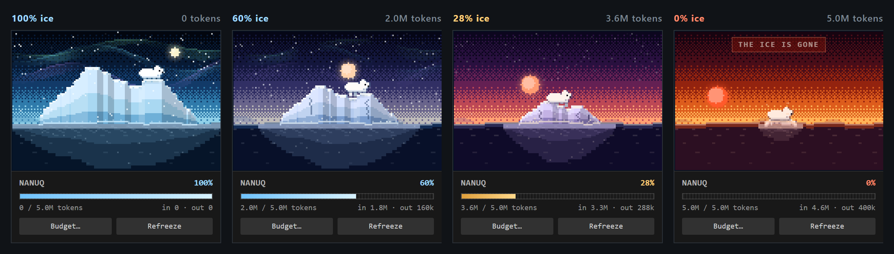
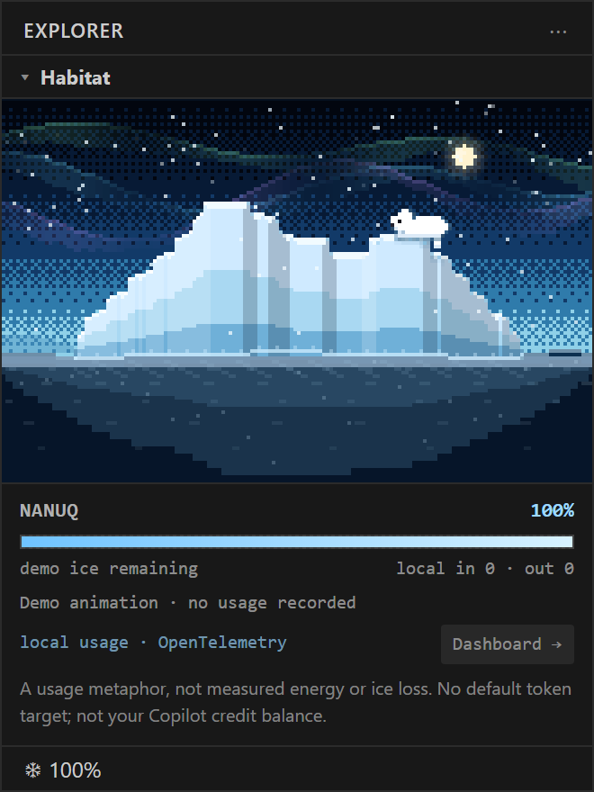
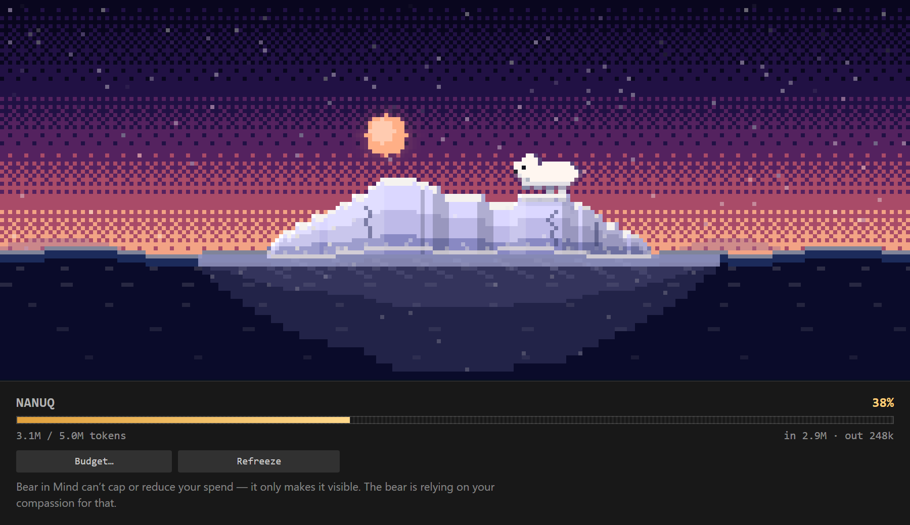

<div align="center">


# 🧊 Iceberg — Copilot Token Meter

**A polar bear lives in your sidebar. Every token you burn melts its home.**

[](https://github.com/obrocki/iceberg-copilot/actions/workflows/ci.yml)
[](https://github.com/obrocki/iceberg-copilot/actions/workflows/build-vsix.yml)
[](LICENSE)
[](https://code.visualstudio.com/)
[](CONTRIBUTING.md)

</div>

---

Iceberg turns your Copilot token consumption into something you can actually
feel. It watches how many tokens you burn, and shrinks a hand-drawn arctic scene
to match. No dashboard, no numbers to interpret — just a bear with progressively
less to stand on.

> [!NOTE]
> **Iceberg has no enforcement mechanism.** It cannot cap your spend, throttle a
> request, block a prompt, or change your bill in any way. It only makes the
> burn visible. The entire mechanism is compassion for the polar bear — you see
> its home shrinking, and you think twice about the next 40k-token agent run.
> That is the whole product. If your plan is unmetered, the counter still climbs
> and the ice still melts; the bear does not know or care about your billing tier.

<div align="center">
  
  <br />
  <sub>The full melt, and a refreeze. Roughly 5 million tokens compressed into eight seconds.</sub>
</div>

## The melt

The iceberg's width, height, and the strip of ice the bear can walk on all scale
with your remaining budget. So does everything else in the scene.



| Ice remaining | What happens |
| --- | --- |
| **100–70%** | Polar night. Aurora overhead, stars, a calm sea. The bear roams the full ridge. |
| **70–40%** | The sky warms toward sunset. The berg loses height first, then width. Cracks start to show. |
| **40–15%** | Amber and red. Chunks calve off into the water, meltwater drips, the bear's walkable strip narrows to a few tiles. |
| **15–1%** | Scorched sky. A floe barely wider than the bear. It stops roaming and starts shivering. |
| **0%** | `THE ICE IS GONE`. |

## Install

Grab the `.vsix` from the [latest release](https://github.com/obrocki/iceberg-copilot/releases)
and install it:

```bash
code --install-extension iceberg-copilot-*.vsix
```

Every merge to `main` also publishes a fresh build to the rolling
[`dev` pre-release](https://github.com/obrocki/iceberg-copilot/releases/tag/dev)
if you want the newest ice.

Or build it yourself:

```bash
npm install
npm run vsix
code --install-extension iceberg-copilot-*.vsix
```

Or press <kbd>F5</kbd> in the repo to launch an Extension Development Host.

Then open the 🧊 icon in the activity bar. For a larger view, run
**Iceberg: Open Habitat in Editor**.

<table>
<tr>
<td width="34%"></td>
<td></td>
</tr>
<tr>
<td align="center"><sub>The sidebar view.</sub></td>
<td align="center"><sub><b>Iceberg: Open Habitat in Editor</b> for the wide view.</sub></td>
</tr>
</table>

## How tokens get counted

**Regular Copilot Chat is metered automatically.** You do not have to do
anything — Ask, Edit and Agent requests all count, whichever model you use.

VS Code records the exact per-request counters (`promptTokens`,
`completionTokens` and `copilotCredits`) in the chat transcripts it keeps under

```
<user-data>/User/globalStorage/emptyWindowChatSessions/*.jsonl
<user-data>/User/workspaceStorage/<id>/chatSessions/*.jsonl
```

Iceberg tails those append-only logs and charges the numbers Copilot itself
reported. No estimating, no tokenizer guesswork. This is the mechanism because
there is no VS Code API that lets one extension observe another's language-model
traffic — if you know of one, please open an issue.

<details>
<summary><b>Details worth knowing</b></summary>

<br />

- **Only growth is charged.** Counters are cumulative per request and get
  rewritten as an agent turn works through its tool calls — one real request
  climbed from 23,516 to 102,515 prompt tokens over a single turn.
- **History is never charged.** On first run your existing transcripts are
  adopted as a baseline. When VS Code seeds a continuation transcript with a
  snapshot of an earlier session, that snapshot is treated as history too.
  Installing this extension will not instantly melt your iceberg.
- **Agent mode is expensive.** It resends context every turn, so prompt tokens
  dominate roughly 10:1 and a single heavy session can be 2M+ tokens. That is
  why the default budget is 5,000,000.
- **Nothing leaves your machine.** No network access; prompt and response text is
  never read. See [SECURITY.md](SECURITY.md).
- Turn it all off with `"iceberg.trackCopilotChat": false`.

</details>

### Other ways to burn ice

| Source | What it counts |
| --- | --- |
| **Copilot Chat** *(automatic)* | Exact prompt + completion tokens and premium-request credits, read from VS Code's own transcripts. |
| **`@iceberg` chat participant** | Real prompt + completion tokens via the model's own `countTokens`. Ask the bear anything. |
| **Extension API** | Other extensions call `reportUsage({ input, output })`. |
| **`iceberg.report` command** | Usable from tasks, scripts, or other extensions. |
| **Iceberg: Count Selection as Prompt Tokens** | Tokenizes the current selection (or file) and burns it. |
| **Iceberg: Add Tokens Manually…** | Accepts `2500` or `2000/500` (input/output). |
| **Iceberg: Toggle Meltdown Demo** | Burns the whole budget over ~60s so you can watch the melt. |

Reporting from another extension:

```ts
const iceberg = vscode.extensions.getExtension('obrocki.iceberg-copilot');
const api = await iceberg?.activate();

api?.reportUsage({ input: 1843, output: 512 });
api?.onDidChangeUsage((s) => console.log(s.health)); // 1 = pristine, 0 = melted
```

Or without a dependency on the API shape:

```ts
vscode.commands.executeCommand('iceberg.report', { input: 1200, output: 340 });
```

Usage is persisted in global state, so the iceberg stays melted across restarts
until you refreeze it.

## Commands

| Command | Description |
| --- | --- |
| `Iceberg: Open Habitat in Editor` | Big view in an editor tab. |
| `Iceberg: Refreeze (Reset Usage)` | Zeroes the meter and re-baselines the chat watcher, so a reset never re-imports what you already burned. |
| `Iceberg: Set Token Budget…` | How many tokens equal a fully melted berg. |
| `Iceberg: Add Tokens Manually…` | Burn a specific amount. |
| `Iceberg: Count Selection as Prompt Tokens` | Tokenize and burn the selection. |
| `Iceberg: Show Usage Stats` | Totals, credits, and whether auto-tracking is on. |
| `Iceberg: Toggle Meltdown Demo` | Watch the whole melt in a minute. |

## Settings

| Setting | Default | Description |
| --- | --- | --- |
| `iceberg.tokenBudget` | `5000000` | Tokens that melt the berg completely. |
| `iceberg.trackCopilotChat` | `true` | Auto-meter regular Copilot Chat usage. |
| `iceberg.chatPollIntervalMs` | `4000` | How often to check the transcripts. |
| `iceberg.countInputTokens` | `true` | Count prompt tokens. |
| `iceberg.countOutputTokens` | `true` | Count completion tokens. |
| `iceberg.statusBar` | `true` | Show `❄ 62%` in the status bar. |
| `iceberg.animate` | `true` | Animate. Off = static frame, near-zero CPU. |
| `iceberg.pixelScale` | `0` | Pixel size. `0` auto-fits the panel. |
| `iceberg.bearName` | `Nanuq` | Your bear's name. |

## Troubleshooting

**The percentage never moves.**
Run **Iceberg: Show Usage Stats** — it reports whether auto-tracking is on. Then
open View → Output → **Iceberg**, which logs every batch of tokens charged. A
silent channel means the watcher is not seeing new counters; check that
`iceberg.trackCopilotChat` is `true` and that your VS Code build is recent enough
to record token counts (1.130+).

Note that an unlimited or unmetered Copilot plan makes no difference here —
Iceberg counts the tokens VS Code records, not what you are billed. The ice melts
either way. (And Iceberg never limits anything; see the note at the top.)

**It moves, but slower than I expected.**
VS Code flushes transcripts lazily — usually within a minute. The default poll
interval is 4 seconds on top of that.

**It melted the moment I installed it.**
It shouldn't; existing history is baselined. If it did, run **Iceberg: Refreeze**
and please [open an issue](https://github.com/obrocki/iceberg-copilot/issues) —
that is a bug worth knowing about.

## Building the extension

One command does everything, and it is the same one CI runs:

```bash
npm run vsix
```

It typechecks, bundles with esbuild, packages with `vsce`, and then **reopens the
archive and checks what actually shipped** — because a `.vsix` with a missing
`dist/extension.js` still packages "successfully" and only fails once someone
installs it. It verifies that every required file is present, that no sources,
source maps or `node_modules` leaked in, that every contributed command really
exists in the bundle, and that every asset the manifest points at was packaged.

```
▸ typecheck  tsc --noEmit · 788 ms
▸ bundle     esbuild --production · 124 ms
▸ package    vsce package · 1541 ms
▸ verify     11 entries · required files present · nothing leaked

iceberg-copilot-0.2.1.vsix  29.5 kB · 0.2.1 · obrocki.iceberg-copilot
```

Inside VS Code it is the default build task — <kbd>Ctrl</kbd>+<kbd>Shift</kbd>+<kbd>B</kbd>,
or **Tasks: Run Build Task** → **Build VSIX**. Run
`node tools/build-vsix.js --help` for the flags (`--pre-release`, `--version`,
`--label`, `--out-dir`, …).

### On GitHub

| Workflow | Trigger | Result |
| --- | --- | --- |
| **Build VSIX** | Every merge to `main` | A `.vsix` artifact on the run, and the rolling [`dev` pre-release](https://github.com/obrocki/iceberg-copilot/releases/tag/dev) refreshed to match. |
| **Build VSIX** | Actions tab → *Run workflow* | Same, on demand. Optionally stamp a version (`0.3.0`) or mark it as a Marketplace pre-release, without committing a version bump. |
| **CI** | Every pull request | Builds and verifies on Linux, Windows and macOS, and attaches a `.vsix` to the run so a reviewer can install the branch. |
| **Release** | Pushing a `v*` tag | Checks the tag matches `package.json`, attaches the `.vsix` to a GitHub release, and publishes to the Marketplace if a `VSCE_PAT` secret exists. |

Builds that aren't tagged carry the commit in their file name —
`iceberg-copilot-0.2.1+3f2a1c9.vsix` — so two builds of the same version are
still tellable apart.

## Notes on the rendering

Everything is drawn at roughly 200×130 internal pixels with nearest-neighbour
upscaling, capped at 30fps. The iceberg silhouette comes from a seeded
value-noise profile that is terraced into flat facets, so the berg keeps its
identity while it shrinks. Lighting is derived from the local surface slope,
quantised to three levels, rather than from screen position — that is what makes
it read as ice rather than as a hill. The bear's paws each sample their own
column of ice, so it stands correctly on slopes and ledges.

Click the scene to make the bear hop.

## Contributing

Bug reports, art, and better bear animation all welcome. See
[CONTRIBUTING.md](CONTRIBUTING.md) — it documents the architecture and, more
usefully, the several sharp edges in VS Code's transcript format that the
accounting has to handle.

## License

[MIT](LICENSE) © Dawid Obrocki
