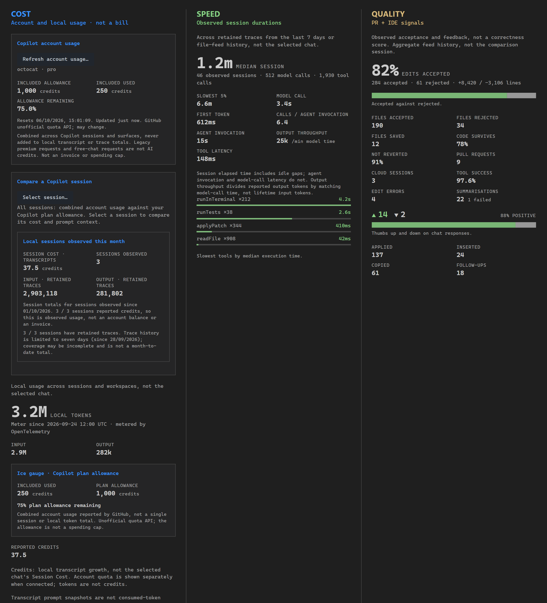
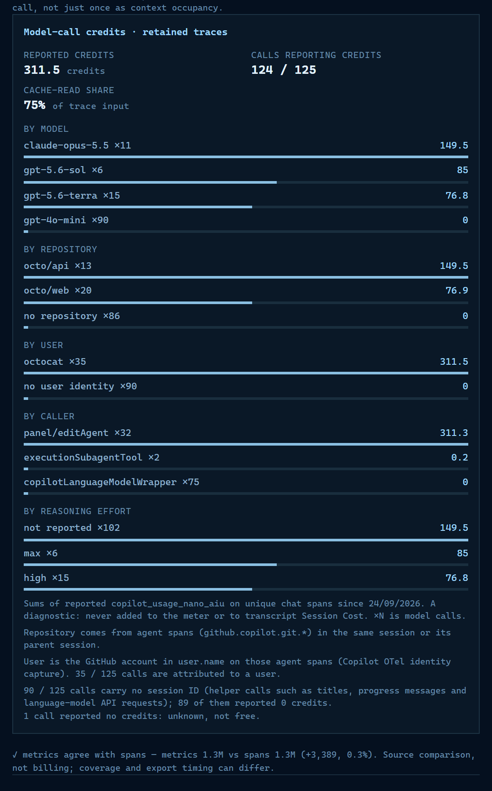
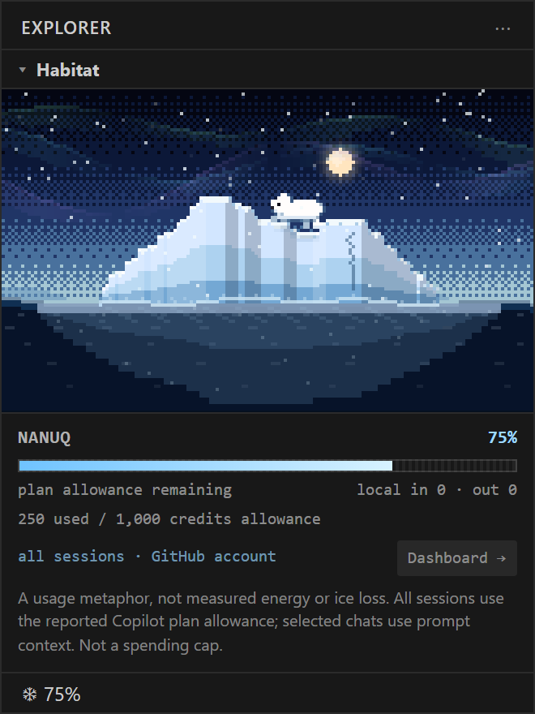
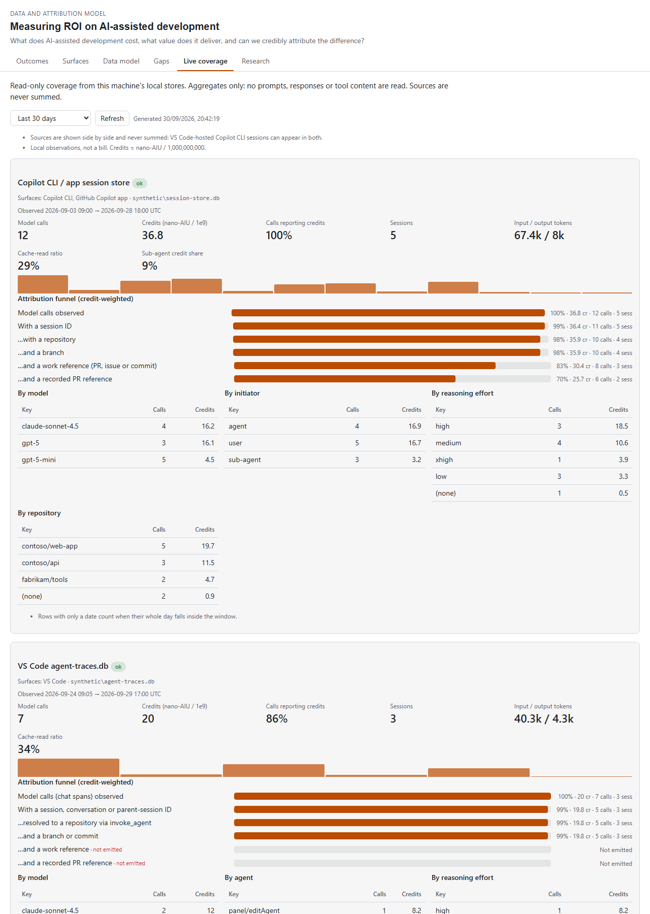

# 🐻‍❄️ Bear in Mind — Copilot Token Meter

Track your reported Copilot plan allowance and combined account usage in your
sidebar, with a dashboard for tokens, credits, speed and quality signals.
Select a chat to compare its cost and reported prompt context. The polar bear's ice is a **usage metaphor**,
not a measurement of energy consumption, CO2 or real ice loss.

[](https://github.com/obrocki/bear-in-mind/actions/workflows/ci.yml)
[](LICENSE)

Bear in Mind visualises usage. **It cannot cap spending, throttle requests or
change your bill**, including on unlimited plans.


## Install

Download a `.vsix` from [Releases](https://github.com/obrocki/bear-in-mind/releases),
then run:

```bash
code --install-extension bear-in-mind-0.6.4.vsix
```

Use the downloaded filename if it differs. Open the Iceberg activity-bar icon.
Every merge also updates the rolling
[`dev` build](https://github.com/obrocki/bear-in-mind/releases/tag/dev).
A new package version is released automatically after all `main` CI platforms
pass. The release attaches a verified VSIX; Marketplace publishing additionally
requires the repository's `VSCE_PAT` secret.

## The dashboard

Open **Iceberg: Open Token Dashboard** or the sidebar's *Cost, Speed, Quality* view.



| Section | Signals |
| --- | --- |
| Cost | Combined account usage and reported plan allowance; selected-session cost and prompt context. Local model-call tokens and credits, cache/reasoning subtotals, cache-read share and feed rate. Retained-trace credits by model, repository, user, caller and reasoning effort. Not a bill. |
| Speed | Elapsed session duration, agent-invocation latency, model-call latency, legacy first token and canonical first stream chunk (kept separate), output throughput and slow tools. |
| Quality | Edit acceptance, code survival, pull requests, tool success and response feedback. Not a correctness score. |

Token share is not credit share. Retained-trace credits expose small helper
calls. Repository and branch come from agent spans; with identity capture on,
credits are also grouped by the reported `user.name`. Calls without matching
agent context remain unattributed.

The dashboard follows VS Code light, dark and high-contrast themes; the habitat
artwork keeps its polar-night palette. Retained token diagnostics show reporting
coverage, preserve measured zeroes and leave unreported fields unknown.
Cache-read share uses only valid paired input/cache reports, not an incomplete
cache subtotal divided by every call's input.

SDK-harness `github.copilot.nano_aiu` appears separately as **SDK root-invocation
credits** only when retained parent metadata confirms the invocation root.
Child/nested totals are excluded; missing or inconsistent ancestry stays
unclassified. These different-grain credits are never added to VS Code
model-call credits, the meter or transcript Session Cost. A model's `cost`
multiplier is not credits or money.



With **All sessions** (the default), the gauge uses GitHub's reported remaining
**Copilot plan allowance across sessions and surfaces**, not one chat's context
or the sum of local observations. Run **Iceberg: Refresh Copilot Account Usage…**
or **Refresh account usage…** in the dashboard to authorize VS Code's GitHub
sign-in. The extension refreshes once a minute; it never prompts automatically.

The account connection uses the **unofficial `copilot_internal/user` API used
by VS Code**. GitHub's documented billing usage APIs do not expose the same
plan allowance. The quota response supplies the plan, remaining percentage,
included allowance when reported, and reset date; no plan limits are hard-coded.
Counts derived from percentages are labeled approximate. Legacy premium-request
quotas and free-chat quotas retain their own units rather than becoming AI credits.
Pooled/unlimited plans have no per-user denominator, so their account gauge stays
unscaled; reported pooled credits can still be displayed.

Selecting a comparison session switches the gauge to that session's **reported
prompt allowance**, when available. Missing, failed, stale (over 15 minutes old)
or reset account quotas and missing/stale prompt limits leave the ice
**unscaled**, unless you explicitly set a personal `iceberg.tokenBudget`.
Account errors are visible, and a missing pinned session never switches to
another chat or account scope. Neither gauge is a spending cap. The synthetic
demo never changes usage.



### Understanding the readings

The dashboard and Copilot report different units and scopes:

| Reading | Meaning |
| --- | --- |
| Copilot account usage and allowance | GitHub quota API values across sessions and surfaces, with reported plan and reset date. Requires authorized GitHub sign-in; unofficial API, not an invoice. |
| Copilot **Session Cost** | Compare with transcript credits for the same session. Uses VS Code's `max(sum(turn credits), reported session credits)` formula and includes existing history. |
| Local tokens | Persisted metric/span usage since the meter start, reconciled by per-dimension maximum, plus labeled manual reports. Not a session or billing-period total. |
| Trace credits | Reported on unique model-call spans. Coverage is shown; missing credits are unknown. Diagnostics only, never added to transcript credits or the meter. |
| Gauge with All sessions | Remaining account allowance from GitHub, kept separate from local tokens and credits. Pooled/unlimited plans have no percentage denominator. |
| Context Window and selected-session gauge | The native window includes prompt and completion tokens against the selected model's full window. The selected-session gauge uses a trace's reported prompt allowance, not that full window. |

Use **Iceberg: Select Comparison Session** (or **Select session…** in the
dashboard) to pin a session, or choose **All sessions** to return to combined
account usage. Session names come from the same local chat-history index used
by VS Code, including generated titles and renames; IDs remain searchable.
Both JSON and JSONL transcript formats are supported. No session is selected
automatically, and this does not detect the active editor chat.
The dashboard also shows **local sessions observed since the 1st**, separately
from account usage. These session totals can include earlier history; they are
not a billing-period usage report. Transcript credits take precedence; trace-credit fallbacks are labeled
and never added to them. Trace data covers at most seven retained days and may
be incomplete. These are local observations, not an account balance or invoice.
Use **Iceberg: Telemetry Diagnostics** for totals, coverage, meter start and
gauge basis.

VS Code has no supported third-party API for quota or active-chat detection.
The unofficial GitHub quota API can change or fail; its failures do not become
zero-usage claims. Disable account requests with `iceberg.accountUsage.enabled:
false`. No local transcripts or telemetry are sent, credentials and account
quota data are not persisted, and local metering works without the connection.
See the [ROI research](docs/research/ai-telemetry-attribution.md) for telemetry details.

## Connecting the telemetry

Run **Iceberg: Connect Copilot Telemetry…**, choose a source, reload the window,
then send a chat request. Allow time for the export to arrive.

| Source | Provides | Exporter impact |
| --- | --- | --- |
| Local trace store (`agent-traces.db`) | Model-call tokens, optional credits, exact timings, reported prompt limits, session repository/branch and user, callers, reasoning effort and tool-span status. | Runs alongside an existing OTLP collector. |
| JSON-lines file feed | Token metrics, quality signals and (in current Copilot) serialized spans with session details. | **Replaces the OTLP exporter.** The command warns first. |
| Both | All available signals. | Same replacement caveat as the file feed. |

Older file-feed spans may serialize as `{}`; use the trace store for exact
timings and session credits on those builds. Quality appears after actions such
as accepting/rejecting an edit or rating a response. An empty section
[is waiting for signals](docs/media/dashboard-waiting.png), not asking you to
reconnect.

### Attributing usage to a user

Copilot Chat can add your identity to its telemetry
(`github.copilot.chat.otel.captureIdentity`, VS Code 1.140+). It is off by
default, so after you pick a source, Connect asks separately whether to turn it
on. When on, agent invocation spans carry `user.name` (your GitHub account) and
telemetry resources carry `process.user.name` and `host.name`. Bear in Mind keys
user attribution on `user.name`: model calls inherit it from the latest agent
span at or before the call through session, conversation, parent-session or
trace keys, without crossing conflicting native chat IDs; calls before any
such span stay unattributed. The trace store keeps span attributes only, so the
OS user and host name are not available from it.

SDK `enduser.pseudo.id` is an opaque analytics identity, shown separately from
GitHub-account labels. Explicit resource `user.name` values retain configured
provenance; neither kind is a verified organisation join. Canonical actor/device
keys are derived, and team/cost-centre assignments need configured attributes or
governed enrichment. The extension does not infer a person from an OS user,
machine or repository owner.

Identity capture also reaches an OTLP collector that stays connected, and the
prompt says so. If replacing a collector fails, Connect leaves identity capture
off. `COPILOT_OTEL_CAPTURE_IDENTITY` outranks the setting, so when it is set
Connect does not offer the choice. An organisation policy
(`CopilotOtelCaptureIdentity`) overrides both, and identity currently covers
only the Local chat harness, not the Copilot harness. **Iceberg: Telemetry
Diagnostics** shows whether capture is requested and how many retained calls
are attributed to a user.

### Disconnecting and restoring defaults

Choose **Restore defaults and disconnect…** in the connect picker or dashboard,
or run **Iceberg: Restore Defaults and Disconnect…**. A confirmation lists
changes first. Restore then:

- returns each Copilot Chat telemetry setting it changed, including identity
  capture, to your previous user value (or the default), leaving any you changed
  yourself afterwards alone;
- resets Bear in Mind's user settings, but not workspace settings;
- deletes its meter history, session pin and its own storage folder, which holds
  the default feed file. The folder is kept while Copilot is still set to write
  there, and a feed at a custom `iceberg.otel.feedPath` is never deleted. Other
  open windows stop saving their copies and start fresh when reloaded.

Copilot's trace store and transcripts are untouched. Reload so Copilot Chat
applies the restored settings, or choose **Uninstall Bear in Mind**. Connections
made before 0.6.3 have no saved previous values; only settings still matching
Bear in Mind's values can be reset.

Quality uses cumulative metrics where available and documented events otherwise;
the two are never added together. When tool-call data is absent, retained
`execute_tool` span statuses provide **Tool success · traces**. Only OK and
ERROR count; missing and UNSET statuses are unknown.

## How tokens get counted

Only `chat` spans count; span IDs deduplicate file and SQLite copies, and parent
`invoke_agent` totals are excluded. Metrics and spans may overlap, so the meter
uses their per-dimension maximum, not their sum. Coverage may be incomplete.
Transcripts supply session metadata and reported credits only; token snapshots
are ignored and not metered. Manual reports are separate and labeled. `@iceberg`
uses reported telemetry, not estimates from visible text. Metering stays local; see
[SECURITY.md](SECURITY.md).

## API

The exported API and `iceberg.report` command share one implementation and accept
`{ input?, output? }`. A numeric argument remains supported as input tokens.
Report only usage the automatic watchers do **not** already see.

```ts
const extension = vscode.extensions.getExtension('obrocki.bear-in-mind');
const api = await extension?.activate();
api?.reportUsage({ input: 1200, output: 340 });
```

The equivalent command is `vscode.commands.executeCommand('iceberg.report', { input: 1200, output: 340 })`.

| Member | Contract |
| --- | --- |
| `reportUsage(usage)` | Adds a report; missing fields are zero. Non-positive/non-finite values are ignored; positive values are rounded. |
| `getUsage()` | Current totals, optional budget (`0` = none), animation `health` (0–1), source (`otel` or `none`), basis, context, manual/legacy counts and metric/span drift. Only display a percentage for a measured/custom basis, never `unavailable`. |
| `onDidChangeUsage(listener)` | Usage snapshots; returns a disposable subscription. |

Types: [`IcebergApi`, `UsageReport`, `UsageSnapshot`](src/api.ts).
The meltdown demo never changes usage. `@iceberg` is counted only by automatic telemetry.

## Commands and settings

Search the Command Palette for **Iceberg** to open the habitat/dashboard, connect
or disconnect telemetry, inspect diagnostics/stats, name the bear or toggle the
meltdown demo.

Common settings:

| Setting | Default | Purpose |
| --- | --- | --- |
| `iceberg.tokenBudget` | `0` | No default target. Positive values opt into a personal fallback, not a Copilot limit. |
| `iceberg.trackCopilotChat` | `true` | Read transcript session metadata and reported credits; ignore token snapshots. |
| `iceberg.otel.enabled` | `true` | Read local telemetry. |
| `iceberg.otel.authoritative` | `true` | Include new telemetry usage in the meter; off makes it display-only. |
| `iceberg.otel.feedPath` | `""` | Override the feed path; otherwise follow Copilot's configuration. |
| `iceberg.otel.tracesDbPath` | `""` | Override trace-store discovery. |

Use **Settings → Iceberg** for polling, input/output counting, animation, pixel
scale, status bar and bear name. Turning telemetry off does not erase counted usage.

## Troubleshooting

- **No data:** reload after connecting, send a chat request, then run
  **Iceberg: Telemetry Diagnostics**. Check **View → Output → Iceberg**.
  Transcript credit comparison requires a VS Code build that persists usage metadata.
- **Quality is empty:** an active feed can have token data before any quality
  actions occur. Trace-store-only setups show tool success only; edit, survival
  and feedback signals need a file feed.
- **No user breakdown:** turn on `github.copilot.chat.otel.captureIdentity`
  (or reconnect and accept the identity prompt), reload, and send a request from
  the Local harness. A policy can deny capture; diagnostics show what was observed.
- **Collector stopped:** clear `github.copilot.chat.otel.outfile` to restore OTLP,
  or run **Iceberg: Restore Defaults and Disconnect…**; use the local trace store
  alongside it.
- **Duplicate menus:** remove old `local.iceberg-copilot` or
  `obrocki.iceberg-copilot` installs, then reload. `iceberg.*` settings remain valid.

## Research: ROI on AI-assisted development

The [ROI research](docs/research/ai-telemetry-attribution.md) compares telemetry
across Copilot surfaces and proposes an attribution model. The [AI attribution
canvas](.github/extensions/ai-attribution/README.md) renders it with read-only
local coverage. Neither is part of the VSIX; reported usage alone does not prove
monetary return.



## Development

```bash
npm ci
npm test
npm run vsix
```

The VSIX build typechecks, bundles and verifies the archive. Press `F5` for an
Extension Development Host. See [CONTRIBUTING.md](CONTRIBUTING.md) for architecture,
accounting invariants and release steps.

[MIT](LICENSE) © Dawid Obrocki
