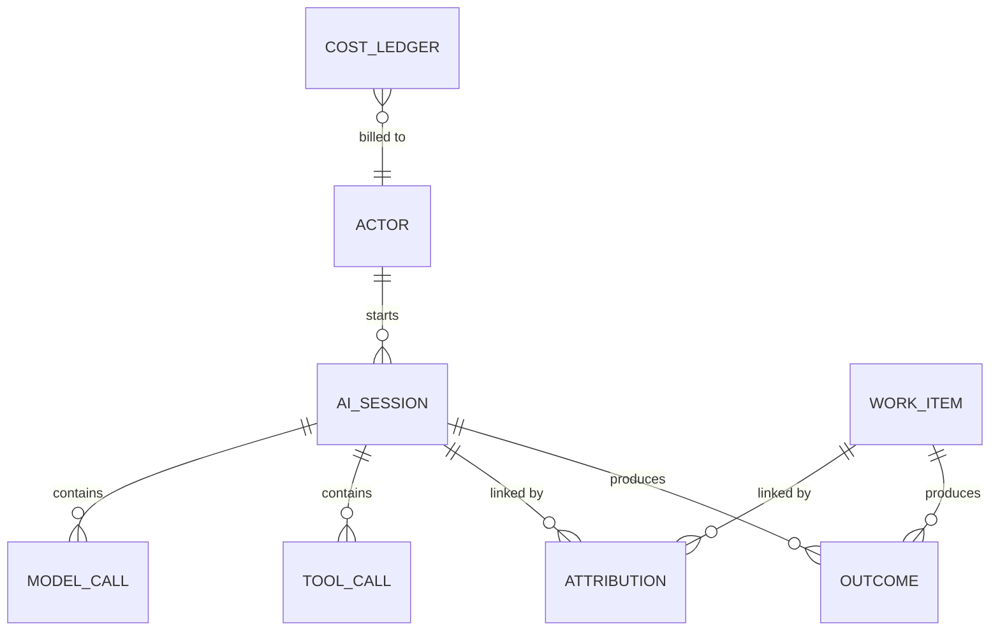

# Measuring ROI on AI-assisted development across GitHub Copilot surfaces

Research for **Data and Attribution Model**. The question: *what
does AI-assisted development cost, what value does it deliver, and how can we
attribute the difference?* Compiled
30 September 2026; updated 5 October 2026 for measurement feasibility,
current primary documentation and the shared-surface intersection.

Scope: VS Code (Copilot Chat agents), Copilot CLI, the GitHub Copilot app,
Copilot cloud agent (plus Copilot code review) and the organisation plane
(usage metrics, billing and audit APIs). Earlier work reviewed: Bear in Mind
(this repository), `mohanajuhi166/agentic-sdlc-prototypes-patterns` and two
hackathon prototypes (`copilot-insights`, `vscode-insights`).

The structured model behind this document is
[`attribution-model.json`](attribution-model.json). The
[AI attribution canvas](../../.github/extensions/ai-attribution/README.md) renders
it in the GitHub Copilot app, along with live coverage from local stores.

## ROI measurement contract

**Reported usage is an input, not a return.** The local coverage funnel measures
the share of *reported* credits that can be traced to a session, repository,
branch and recorded PR reference. A PR reference is not evidence that the PR
merged, that AI caused the result, or that the result had value. Cache-read
share, sub-agent share and latency describe usage patterns, not savings.
Missing credits remain unknown; the CLI/app and VS Code windows and sources
must be shown separately rather than added.

To evaluate ROI, compare a defined population of AI-assisted work with
comparable non-AI work over the same period, accounting for task mix,
complexity, team and quality. Collect:

| Component | Measurement needed | Available here |
| --- | --- | --- |
| Investment | Billed AI spend, seats/infrastructure, setup, prompting, review and rework time | Local reported credits and tokens only; not a bill or human effort |
| Delivered value | Verified merged/deployed work, cycle time, quality/reverts, and a declared valuation of time or business outcomes | Some local activity proxies; no verified PR/CI linkage or monetary value |
| Baseline | Comparable non-AI delivery and quality, with the same value and cost definitions | Not collected |
| Attribution confidence | Session → work item → verified outcome, with tier and unattributed share | Local repository and sometimes PR references; no outcome join |

An illustrative return is **(incremental valued benefit − AI investment) /
AI investment**, with the investment including the full incremental spend
and human oversight. Define the benefit and counterfactual before computing
it; do not count saved time again as avoided cost if it is already valued as
benefit. If any of these inputs is absent, report coverage and directional
proxies rather than a percentage ROI. Faster PRs or more merged PRs alone do
not establish business value or causation.

### Shared-surface intersection

The canvas's **Intersection** tab derives the common concepts directly from
the surface matrix: a concept qualifies only when every surface marks it
native, partial or derived. Missing or unverified cells exclude it. **Native
across all** means directly emitted everywhere; **Conditional across all**
includes opt-in, aggregate, panel-only and otherwise partial availability.
Neither label guarantees an identical value, grain or join key.

The current intersection is time, surface/client, actor, agent, model, tokens,
credits, repository and code change. Only repository and code change are marked
native across all. Organisation time is daily, token totals cover CLI/app only,
local actor identifiers can be pseudonymous, and cloud tokens are panel-only.
Session IDs, branch/commit, request IDs, reasoning effort, latency, tool calls
and verified quality are not universal. Always retain each source's scope and
conditions rather than treating the intersection as a cross-surface inner join.

## 1. Headline findings

1. **Two telemetry families, one shape.** VS Code Copilot Chat emits
   OpenTelemetry with `gen_ai.*`, `github.copilot.*` and legacy `copilot_chat.*`
   attributes. Copilot CLI, the Copilot app and the Copilot SDK share one agent
   runtime. Its session events (`assistant.usage`, `session.start`,
   `session.shutdown`, `tool.execution_*`, `skill.invoked`, `subagent.*`) feed a
   local session store and optional OTel export. Both families follow the GenAI
   span tree `invoke_agent → chat → execute_tool` and propagate W3C trace context.
2. **Per-call consumption is well covered, and credits share one source.** Every
   local runtime can report model, input/output/cache/reasoning tokens, duration and
   time to first token per call, but optional fields are not complete on every
   call. The canvas exposes each token field's reporting coverage and nullable
   reported subtotal. Cache-read share uses only calls reporting both valid
   counts, not all input tokens paired with an incomplete cache subtotal.
   VS Code's `copilot_chat.copilot_usage_nano_aiu`
   and the CLI/app's `copilotUsage.totalNanoAiu` both carry the Copilot API's
   `copilot_usage.total_nano_aiu`, so credits are comparable across surfaces.
3. **Work linkage stops at the branch.** Repository, branch and commit exist
   locally: on VS Code `invoke_agent` spans and in CLI/app `session.start.context`.
   VS Code emits no pull request, issue or work-item ID. Copilot CLI and the app
   record one in `session_refs` only when the agent happens to reference it; the
   measured store had none. The cloud agent is the exception, because its session
   owns a branch and pull request.
4. **Outcomes are fragmented and scoped differently.** VS Code reports edit
   acceptance, survival and feedback. CLI/app report lines changed and task
   completion. The cloud agent produces pull requests. The organisation plane
   reports pull-request throughput and merge time, but only as daily aggregates
   without session IDs.
5. **There is no verified local login join by default.** VS Code 1.140 adds opt-in identity
   capture (`github.copilot.chat.otel.captureIdentity`): `user.name`, the
   signed-in GitHub account, on agent invocation spans, plus `process.user.name`
   and `host.name` as resource attributes. It is off by default, a managed
   policy takes precedence, and it covers only the Local harness. `agent-traces.db`
   keeps span attributes, so it holds `user.name` but not the resource
   attributes. Without it, VS Code `session.id` identifies a window, not a
   person. CLI and app stores hold no user ID; their OTel agent spans can carry
   `enduser.pseudo.id`, an analytics pseudonym that is not a verified GitHub login.
   Organisation APIs are keyed by
   `user_login` and day, so `user.name` gives VS Code a direct user/day join;
   a collector should pseudonymise it before storage.
6. **Each surface holds one half of the join.** Measured on one developer
   machine on 30 September 2026 (credit-weighted):

   | Source | Window | Model calls | Calls reporting credits | Credits with repository | Credits with PR |
   | --- | --- | --- | --- | --- | --- |
   | CLI / app session store | 30 days | 2,853 in 33 sessions | 100% | 86% | 0% |
   | VS Code `agent-traces.db` | retained (~7 days) | 125 | 99% | 100% (31% of calls) | not emitted |
   | Cloud agent (synced history) | 30 days | 16 sessions | not exported | native | 8 sessions |

   Local sessions know what they cost but not which pull request they served.
   Cloud sessions know their pull request but not what they cost. In VS Code,
   the calls with no session ID (69%) were auxiliary and language-model-API calls
   on a zero-credit model, so counting by calls understates repository coverage
   and counting by credits does not.

## 2. Surface catalogue

| | VS Code (Copilot Chat) | Copilot CLI | GitHub Copilot app | Copilot cloud agent | Organisation plane |
| --- | --- | --- | --- | --- | --- |
| **Collection** | OTel OTLP or JSON-lines file; local span DB `agent-traces.db`; transcripts (internal) | Session events in `~/.copilot/session-state/`; SQLite session store; OTel export; cloud session sync | Same runtime and store as CLI | Session logs, Actions run, audit log, session streaming (preview) | Usage metrics REST/NDJSON, billing usage REST, seats, audit log |
| **Session key** | `copilot_chat.chat_session_id`, `gen_ai.conversation.id`; resource `session.id` (per window) | `sessionId`, sub-agent `agentId`, `turn_index` | `sessionId`, one worktree branch per session | `agent_session_id`; task URL `github.com/copilot/tasks/{id}` | None (user/day, org/day, repo/day) |
| **Consumption** | `gen_ai.usage.*` on `chat` spans; `copilot_chat.copilot_usage_nano_aiu`; transcript `copilotCredits` | Optional `assistant.usage` tokens, `copilotUsage.totalNanoAiu`, `cost` multiplier; OTel `github.copilot.nano_aiu` | Same as CLI | Panel usage; usage-based AI credits or legacy annual-plan premium requests; no verified per-session export here | User/day `ai_credits_used` without model split; CLI/app daily token sums; filtered billing gross/discount/net quantities and amounts |
| **Work context** | `github.copilot.git.{repository,branch,commit_sha}`, `github.copilot.github.org` on `invoke_agent` | `session.start.context`: `repository`, `repositoryHost`, `branch`, `headCommit`, `baseCommit`, `gitRoot` | Same, plus the app-managed branch | Repository, branch and pull request are native | Repo/day report (PRs incl. coding agent and code review) |
| **Outcomes** | Edit acceptance, hunk actions, survival, feedback, PR and cloud-session counters | Code changes, self-reported `session.task_complete.summary`, shutdown status and tool success; not verified correctness | Same as CLI | PR opened/merged, commits co-authored by the initiator | PR throughput, merge time, LoC agent vs user; scopes differ |
| **Actor** | Opt-in (1.140+): `user.name` on `invoke_agent` spans; resource `process.user.name`, `host.name` | OTel `enduser.pseudo.id` when available; no identity in local rows | Same runtime | Initiating `user` in audit log | `user_login` |
| **Tools / MCP / skills** | `gen_ai.tool.*`, `github.copilot.tool.parameters.{skill_name,mcp_server_name_hash,mcp_tool_name}` | `toolName`, `mcpServerName`, `mcpToolName`, `skill.invoked`, `subagent.*`, hooks with `traceparent` | Same, plus extensions and canvases | Tool calls in session log | Partial CLI skill/plugin/custom-agent counts and MCP connection attempts; top five, custom names grouped as `other` |

## 3. Commonalities

Canonical concepts that every surface can populate, with each surface's native field:

| Concept | VS Code | CLI / app | Cloud agent | Org plane |
| --- | --- | --- | --- | --- |
| Time | span start/end | event `timestamp` | session log, audit `@timestamp` | `day` |
| Surface | `service.name`, `gen_ai.agent.name` | `session.start.producer` | `actor_is_agent` | report type, `used_*` flags |
| Session | `copilot_chat.chat_session_id` | `sessionId` | `agent_session_id` | — |
| Actor | `user.name` (opt-in, inherited from `invoke_agent`) | OTel `enduser.pseudo.id`; no login in local rows | audit `user`, commit co-author | `user_login` |
| Agent / sub-agent | `gen_ai.agent.name`, `github.copilot.agent.type` | `agentId`, `subagent.*.agentName`, `interactionType` | — | Capped CLI `totals_by_custom_agent`; `totals_by_vscode_agent` is window session/message totals, not agent names |
| Model | `gen_ai.response.model` | `model`, `isAuto`, `isByok` | session log | model breakdowns |
| Reasoning effort | `copilot_chat.request.options` → `reasoning.effort` | `reasoningEffort` | session setting | — |
| Tokens | Optional `gen_ai.usage.{input,output}_tokens`, cache, reasoning | Optional `inputTokens`, `outputTokens`, `cacheRead/WriteTokens`, `reasoningTokens` | panel only | CLI/app daily `token_usage.{prompt_tokens_sum,output_tokens_sum}` |
| Credits | `copilot_chat.copilot_usage_nano_aiu` | `copilotUsage.totalNanoAiu`; OTel `github.copilot.nano_aiu` | Billing unit known; per-session export unverified | User/day `ai_credits_used` without model split; billing quantities/amounts |
| Model call ID | `gen_ai.response.id`, `copilot_chat.server_request_id` | `apiCallId`, `serviceRequestId`, `providerCallId` | — | — |
| Latency | span duration, `copilot_chat.time_to_first_token` | `duration`, `timeToFirstTokenMs` | session length | merge time |
| Tool | `gen_ai.tool.name` | `toolName` | session log | — |
| Repository | `github.copilot.git.repository` | `context.repository` | native | repo/day |
| Branch / commit | `github.copilot.git.{branch,commit_sha}` | `context.{branch,headCommit,baseCommit}` | native | — |
| Pull request | counter only | `session_refs` (when referenced) | native | repo/day counts |
| Outcome | acceptance, survival, feedback | `codeChanges`, `task_complete` | PR state | throughput, merge time |

The local-runtime spine is **the OTel GenAI span tree, session/work context
and per-call usage**. It is not universal: the organisation plane has no session
IDs and its daily quantities cannot populate a per-call record. A shared schema
must retain grain, optional-field coverage and attribution confidence. PR
ownership and a verified actor join still need to be supplied.

## 4. Differences and gaps

| Gap | Where | Consequence | Mitigation |
| --- | --- | --- | --- |
| No reliable PR / issue ID locally | VS Code (none), CLI and app (only when referenced) | Consumption stops at branch/commit | Resolve `(repo, branch)` and `(repo, commit)` to PRs through the GitHub API; adopt `vcs.change.id` |
| No verified per-session cloud cost export | Cloud agent, audit log | Billing unit known, but no session cost source connected here | Verify a usage export, or label billing-based allocation T3 with unmatched usage |
| No session ID in org data | Usage metrics, billing | Per-user consumption has no model/surface split; cannot join to sessions | Use filtered billing AI-credit reports for user/day/model, preserve filters; allocate explicitly |
| No verified local login join by default | VS Code (opt-in only), CLI, app | CLI/app OTel pseudonyms are not a verified login; local rows have no actor | Verify the VS Code login join; add a governed collector identity/mapping for CLI/app and pseudonymise both |
| Session ID missing on many VS Code calls | VS Code | Native session coverage is incomplete | Resolve time-appropriate conversation, parent-session or trace context; trace-only calls do not create sessions |
| Overlapping sources | VS Code metrics vs spans; transcript vs trace; CLI store vs OTel | Double counting or undercount with mismatched windows | Precedence; conservative max only for aligned scopes/windows; never sum parent and child totals |
| No CI/CD linkage | All | Build/deploy outcomes unattributed | Join `cicd.pipeline.run.*` by repository and commit |
| Credits optional on spans | VS Code | Unknown is not zero | Track credit coverage; prefer the session store or transcript |
| MCP server name hashed by default | VS Code | Vendor-level tool cost needs content capture | Keep hash as key; map names in a governed lookup |
| Naming drift | `github.copilot.git.*` vs OTel `vcs.*`; `reasoningEffort` vs `gen_ai.request.reasoning.level` | Custom mapping needed | Normalise to canonical fields at ingest |

## 5. Prior art

| Project | Proved | Learned |
| --- | --- | --- |
| **Bear in Mind** (VS Code extension) | Metering from VS Code OTel file feed, `agent-traces.db` and transcripts; cost/speed/quality dashboard, including retained-trace credits by model, repository, user, caller and reasoning effort, and session repository and user labels | Count only `chat` spans; dedupe by span ID; metrics vs spans use max, not sum; transcript and trace credits are never added; credits = nano-AIU / 1e9; token share is not credit share; file-exported spans can be empty `{}` and need the span DB; `user.name`, like repository, must be inherited from `invoke_agent` |
| **agentic-sdlc-prototypes-patterns** (Copilot Insights + ELK) | OTLP receiver, CLI session-store ingestion, flattened `copilot-insights/elk/v1` documents with `cost`/`speed`/`quality` groups, pseudonymised `developer_id` | Spans rarely carried credits then, so the CLI store was the reliable cost source; repository must be copied from `invoke_agent` to child `chat` spans; OTel and CLI planes overlap without a dedupe key |
| **copilot-insights** (hackathon) | Relational schema (`spans`, `metric_points`, `events`, `llm_calls`, `local_sessions`) joining OTel with the CLI store by session | Repo/branch/commit exist in OTel, but no PR join was built |
| **vscode-insights** (hackathon) | Copilot SDK instrumentation (`assistant.usage`, `subagent.*`, `skill.invoked`, quota snapshots); unified `records` table keyed by trace/span | Keys like `sdk:<sessionId>:call:<apiCallId>` give stable call identity; the account is checked against the signed-in login |

## 6. Proposed canonical data model

| Entity | Grain | Key fields |
| --- | --- | --- |
| `actor` | person | `actor_key` (salted pseudonym of `user.name` / `user_login`), optional device key (`process.user.name`, `host.name`), org, team / cost centre |
| `ai_session` | one agent session | `session_key` = surface + native ID, surface, client version, agent name/type, mode, repo, branch, base/head commit, parent session, start/end |
| `model_call` | one model API call | `call_key`, `session_key`, agent instance, initiator / interaction class, model, auto/BYOK, reasoning effort, input/output/cache-read/cache-write/reasoning tokens, `credits_nano_aiu` (nullable) + credit source, multiplier, duration, TTFT, finish reason |
| `tool_call` | one tool call | `tool_call_key`, class (built-in, MCP, skill, sub-agent, hook), tool, MCP server (hash), success, duration |
| `work_item` | PR, issue, commit, branch, workflow run, task | provider, repo, number / SHA / ref, URL, opened / merged / closed |
| `attribution` | session ↔ work item | tier, method, confidence, evidence, weight (per session ≤ 1) |
| `outcome` | measured result | kind (edit accepted, survival, feedback, lines changed, task complete, PR merged, review rounds, CI result, revert, lead time), value, unit, source |
| `cost_ledger` | billing line with preserved request scope | billing entity/account type, requested UTC day/user/model, product/SKU, unit/rate, gross/discount/net quantities and amounts, retrieval time and coverage — reconciliation only |

### Attribution tiers

| Tier | Method | Example |
| --- | --- | --- |
| T0 native | Work ownership emitted by the surface | Cloud-owned session → PR; audit `agent_session_id`. A mentioned PR is only a reference until verified |
| T1 deterministic | Exact, unambiguous VCS join | Verify head repository, commit and time; disambiguate forks, branch reuse and multiple PR matches |
| T2 inferred | Time and content overlap | Same repo and actor within PR commit window; modified files ∩ PR diff |
| T3 allocated | Proportional share | Org day/user/model credits distributed by attributed local share |
| Unattributed | Kept explicitly | Never dropped, so coverage is always visible |

### Accounting invariants

1. Count each model call once. VS Code reads `chat` credits; CLI OTel's primary guidance reads root `invoke_agent` `github.copilot.nano_aiu`. Never add parent and child totals; validate mappings per surface/version.
2. Never sum overlapping sources; use precedence, or conservative per-dimension max only with aligned scopes/windows, and record the source and coverage.
3. Unknown is not zero; report credit coverage alongside credit totals.
4. Credits = nano-AIU / 1,000,000,000; no token-to-currency estimate without an explicit, labelled rate.
5. Attribution weights per session sum to at most 1; the remainder stays unattributed.
6. Local observations are not a bill; match consumption to gross billing AI-credit quantity at the same scope, retaining discounts and net billed amounts separately.
7. No prompt or response content; pseudonymise actors; keep MCP names hashed unless governed.
8. Token fields are nullable reported subtotals with per-field call coverage. Cache-read share uses only valid paired input/cache counts, with paired-call coverage.

### Billing reconciliation contract

Use the [billing AI-credit usage endpoint](https://docs.github.com/en/rest/billing/usage),
not an inferred model split of organisation `ai_credits_used`. That usage-metrics
field is per-user consumption only, with no feature, model or surface breakdown,
and is not an invoice.

Preserve the billing entity, account type, requested UTC day/user/model filters,
product/SKU, `unitType`, price, retrieval time and coverage alongside each
`usageItems` line: the response does not put every requested dimension on every
line. Personal endpoints exclude organisation-managed seats; query the entity
paying for the seat with appropriate administrative access. Avoid double-counting
overlapping queries with a stable ledger key.

Compare local credits with **gross AI-credit quantity** only when identity,
day, model aliases, product and coverage match. Keep gross, discount and net
quantities/amounts separate. The documented nominal value of one AI credit is
USD 0.01, not proof of an incremental charge after allowances and discounts.
Report signed differences, missing local/cloud usage and unallocated balances.
Any session/work-item allocation from user/day/model totals is T3 estimation,
not measured session billing. Include seats, Actions/infrastructure and human
oversight separately. This canvas does not call billing APIs.

## 7. Desired outcomes

| Outcome | Measure | Status |
| --- | --- | --- |
| PR-reference coverage | % reported credits in sessions with a repository, branch and recorded PR reference (not verified outcome attribution) | Local, generally stops at branch |
| Work-context coverage | % reported credits on calls with resolved repository context, including trace-only links; not verified ownership | Local |
| Credit coverage | % model calls reporting credits | Local |
| Actor coverage | % reported credits on calls attributed to a `user.name`; a join key, not productivity | Local (VS Code, opt-in) |
| Cost per delivered change | Credits per merged PR, per work-item type | Needs T1 join |
| AI-assisted share | % merged PRs with T0/T1 attribution | Needs T1 join + org repo report |
| Usage mix | Paired-count cache-read share with coverage, sub-agent share, model and reasoning-effort mix; not savings | Local |
| Speed | PR lead time AI-assisted vs baseline; agent latency and TTFT | Local latency; lead time needs PR data |
| Quality | Acceptance/survival need the telemetry feed this canvas does not read; reviews, CI, reverts and verified task delivery require joins | Feed plus PR/CI data |
| Reconciliation | Scope-matched local consumption vs gross AI-credit quantity; discounts/net billed amounts separate | Needs billing API and preserved request scope |
| Human effort and rework | Prompting, review, correction and maintenance time for comparable tasks | Needs time/effort data and baseline |
| Incremental return | Valued incremental benefit less AI investment, divided by AI investment, with quality guardrails | Needs verified outcome, valuation, full costs and baseline |

### Recommended next steps

1. **T1 VCS join.** Resolve local `(repository, branch)` and `(repository, head commit)` to pull requests
   through the GitHub API, and record `attribution` rows with tier and evidence.
2. **Actor key.** Turn on VS Code identity capture and key its calls by `user.name`; have the collector add the
   signed-in login to CLI/app sessions; pseudonymise both with the same salt so they join to `user_login`.
3. **Cloud cost.** Verify a session-ID-bearing usage export before treating it as measured cost; otherwise
   label billing-based allocation T3 and keep unmatched usage.
4. **Reconcile.** Use scope-filtered billing AI-credit reports, match consumption to gross quantities,
   preserve discounts/net billed amounts and publish the gap.
5. **Align naming.** Emit or map to OTel `vcs.*` and `cicd.*` so external pipelines can join by commit.
6. **Establish the counterfactual.** Record comparable non-AI delivery, rework and quality, full AI and human costs, and a declared valuation before publishing ROI.

## 8. Verification

Verified against current source and local data:

- `copilot_chat.copilot_usage_nano_aiu` is defined in `genAiAttributes.ts` (`microsoft/vscode`,
  `extensions/copilot`) as the per-request cost from `copilot_usage.total_nano_aiu`. It was present on 124 of
  125 local `chat` spans.
- The `github.copilot.*` namespace (`agent.type`, `git.*`, `github.org`, `tool.parameters.*`, `hook.*`) is
  defined in source and observed locally on `invoke_agent`, `execute_tool` and `execute_hook` spans.
- VS Code has no dedicated reasoning-effort attribute; it is inside the `copilot_chat.request.options` JSON.
- VS Code 1.140 identity capture (`otelIdentity.ts`): with `captureIdentity` on, `user.name` is the GitHub
  session's account label on agent invocation spans, including sub-agents and inline chat, and
  `process.user.name` / `host.name` are resource attributes. It is off by default; a managed policy overrides
  `COPILOT_OTEL_CAPTURE_IDENTITY` and the setting. `agent-traces.db` stores span attributes only. The agent host
  (Copilot harness) is not covered yet ([microsoft/vscode#337413](https://github.com/microsoft/vscode/issues/337413)).
- The primary CLI reference documents OTel enable/export variables, `gen_ai.*` / `github.copilot.*`,
  pseudonymous `enduser.pseudo.id`, and `--max-ai-credits` / `/limits`. Limits are soft, not a hard cap.
- Primary usage-based billing docs include cloud agent and define one AI credit as USD 0.01.
  Legacy premium-request billing remains for eligible existing annual plans. Enterprise-managed OTel and
  cost-centre budgets are documented capabilities, not verification of a particular account.
- Current organisation reports include CLI/app daily tokens and partial CLI customization aggregates.
  MCP counts connection attempts, not tool invocations; plugin interactions are already included in skills.
- SDK `session.task_complete` carries an optional summary, not a success field. Routine
  `session.shutdown.shutdownType` means normal shutdown, not verified correctness.

Still unverified:

- Whether VS Code `user.name` always equals the usage metrics `user_login` (expected; not tested against an
  organisation export).
- Whether `copilot_chat.server_request_id` equals the CLI's `serviceRequestId` (candidate dedupe key).
- A reliable per-session cloud-agent cost export and code-review Actions-minute attribution.
- Limits reset grain/minimum for the installed runtime: the CLI command reference says per response,
  while the session-limit guide says an entire interactive session and a 30-credit minimum. Pin the
  runtime and verify reset and overshoot behaviour before promising either contract.

## 9. Sources

- VS Code: [Monitor agent usage with OpenTelemetry](https://code.visualstudio.com/docs/agents/guides/monitoring-agents), [Optimize AI credit usage](https://code.visualstudio.com/docs/agents/guides/optimize-usage), [Agent harnesses](https://code.visualstudio.com/docs/agents/run/agent-harnesses), [1.140: Capture user identity in OpenTelemetry](https://code.visualstudio.com/updates/v1_140#_capture-user-identity-in-opentelemetry)
- VS Code source: [`genAiAttributes.ts`](https://github.com/microsoft/vscode/blob/main/extensions/copilot/src/platform/otel/common/genAiAttributes.ts), [`otelIdentity.ts`](https://github.com/microsoft/vscode/blob/main/extensions/copilot/src/platform/otel/common/otelIdentity.ts)
- OTel: [GenAI semantic conventions](https://github.com/open-telemetry/semantic-conventions-genai), [MCP attributes](https://opentelemetry.io/docs/specs/semconv/registry/attributes/mcp/), [VCS attributes](https://opentelemetry.io/docs/specs/semconv/registry/attributes/vcs/), [CICD attributes](https://opentelemetry.io/docs/specs/semconv/registry/attributes/cicd/)
- GitHub: [OpenTelemetry for Copilot](https://docs.github.com/en/copilot/concepts/enterprise/opentelemetry), [Session data](https://docs.github.com/en/copilot/concepts/security-governance-and-network-settings/session-data), [CLI command reference](https://docs.github.com/en/copilot/reference/copilot-cli-reference/cli-command-reference), [Copilot app agent sessions](https://docs.github.com/en/copilot/how-tos/github-copilot-app/agent-sessions), [Manage and track agents](https://docs.github.com/en/copilot/how-tos/copilot-on-github/use-copilot-agents/manage-and-track-agents), [Agentic audit log events](https://docs.github.com/en/copilot/reference/enterprise-administrators/agentic-audit-log-events), [Copilot usage metrics](https://docs.github.com/en/copilot/reference/copilot-usage-metrics/copilot-usage-metrics), [Billing usage REST](https://docs.github.com/en/rest/billing/usage), [Copilot user management REST](https://docs.github.com/en/rest/copilot/copilot-user-management), [Metrics data](https://docs.github.com/en/copilot/reference/metrics-data)
- Changelog: [VS Code Agents in usage metrics](https://github.blog/changelog/2026-09-11-add-vs-code-agents-to-copilot-usage-metrics/), [Agent session streaming preview](https://github.blog/changelog/2026-07-02-copilot-agent-session-streaming-is-now-in-public-preview/)
- Copilot SDK: [usage and billing](https://github.com/github/copilot-sdk/blob/main/docs/features/usage-and-billing.md); session event types shipped with the Copilot app SDK (`generated/session-events.d.ts`)
- Current contracts: [SDK streaming events](https://github.com/github/copilot-sdk/blob/main/docs/features/streaming-events.md), [individual AI-credit billing](https://docs.github.com/en/copilot/concepts/billing-and-usage/individuals/billing), [organisation billing and budgets](https://docs.github.com/en/copilot/concepts/billing-and-usage/organizations-and-enterprises/billing), [legacy premium requests](https://docs.github.com/en/copilot/reference/copilot-billing/request-based-billing-legacy/copilot-requests), [CLI limits guide](https://docs.github.com/en/copilot/how-tos/copilot-cli/use-copilot-cli/set-session-limit)
