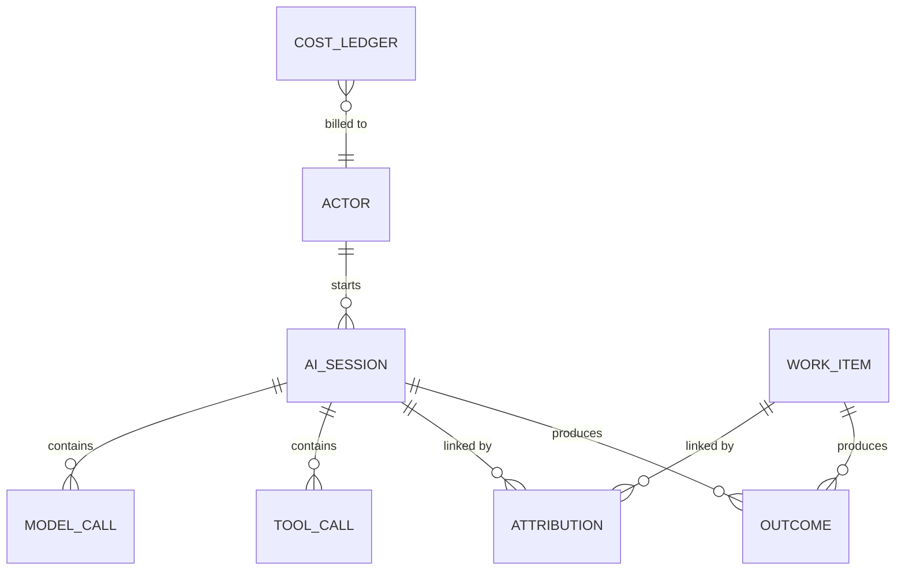

# Connecting AI usage to work and outcomes across GitHub Copilot surfaces

Research for **Workstream 2: Data and Attribution Model**. The question: *how do
we connect AI usage to the work and outcomes it influenced?* Compiled
30 September 2026.

Scope: VS Code (Copilot Chat agents), Copilot CLI, the GitHub Copilot app,
Copilot cloud agent (plus Copilot code review) and the organisation plane
(usage metrics, billing and audit APIs). Earlier work reviewed: Bear in Mind
(this repository), `mohanajuhi166/agentic-sdlc-prototypes-patterns` and two
hackathon prototypes (`copilot-insights`, `vscode-insights`).

The structured model behind this document is
[`attribution-model.json`](attribution-model.json). The
[AI attribution canvas](../../.github/extensions/ai-attribution/README.md) renders
it in the GitHub Copilot app, along with live coverage from local stores.

## 1. Headline findings

1. **Two telemetry families, one shape.** VS Code Copilot Chat emits
   OpenTelemetry with `gen_ai.*`, `github.copilot.*` and legacy `copilot_chat.*`
   attributes. Copilot CLI, the Copilot app and the Copilot SDK share one agent
   runtime. Its session events (`assistant.usage`, `session.start`,
   `session.shutdown`, `tool.execution_*`, `skill.invoked`, `subagent.*`) feed a
   local session store and optional OTel export. Both families follow the GenAI
   span tree `invoke_agent → chat → execute_tool` and propagate W3C trace context.
2. **Per-call consumption is well covered, and credits share one source.** Every
   local surface reports model, input/output/cache/reasoning tokens, duration and
   time to first token per call. VS Code's `copilot_chat.copilot_usage_nano_aiu`
   and the CLI/app's `copilotUsage.totalNanoAiu` both carry the Copilot API's
   `copilot_usage.total_nano_aiu`, so credits are comparable across surfaces.
3. **Work linkage stops at the branch.** Repository, branch and commit exist
   locally: on VS Code `invoke_agent` spans and in CLI/app `session.start.context`.
   No local surface emits a pull request, issue or work-item ID. The cloud agent
   is the exception, because its session owns a branch and pull request.
4. **Outcomes are fragmented and scoped differently.** VS Code reports edit
   acceptance, survival and feedback. CLI/app report lines changed and task
   completion. The cloud agent produces pull requests. The organisation plane
   reports pull-request throughput and merge time, but only as daily aggregates
   without session IDs.
5. **There is no actor locally.** VS Code `session.id` identifies a window, not a
   person, and local stores hold no user ID. Organisation APIs are keyed by
   `user_login` and day. Joining the two needs a pseudonymous actor key that the
   collector holds.
6. **Each surface holds one half of the join.** Measured on one developer
   machine on 30 September 2026 (credit-weighted):

   | Source | Window | Model calls | Calls reporting credits | Credits with repository | Credits with PR |
   | --- | --- | --- | --- | --- | --- |
   | CLI / app session store | 30 days | 2,853 in 33 sessions | 100% | 86% | 0% |
   | VS Code `agent-traces.db` | retained (~7 days) | 125 | 99% | 100% (31% of calls) | not emitted |
   | Cloud agent (synced history) | 30 days | 16 sessions | not exported | native | 8 sessions |

   Local sessions know what they cost but not which pull request they served.
   Cloud sessions know their pull request but not what they cost. In VS Code,
   the calls with no session ID (69%) were auxiliary and language-model-API calls
   on a zero-credit model, so counting by calls understates repository coverage
   and counting by credits does not.

## 2. Surface catalogue

| | VS Code (Copilot Chat) | Copilot CLI | GitHub Copilot app | Copilot cloud agent | Organisation plane |
| --- | --- | --- | --- | --- | --- |
| **Collection** | OTel OTLP or JSON-lines file; local span DB `agent-traces.db`; transcripts (internal) | Session events in `~/.copilot/session-state/`; SQLite session store; OTel export; cloud session sync | Same runtime and store as CLI | Session logs, Actions run, audit log, session streaming (preview) | Usage metrics REST/NDJSON, billing usage REST, seats, audit log |
| **Session key** | `copilot_chat.chat_session_id`, `gen_ai.conversation.id`; resource `session.id` (per window) | `sessionId`, sub-agent `agentId`, `turn_index` | `sessionId`, one worktree branch per session | `agent_session_id`; task URL `github.com/copilot/tasks/{id}` | None (user/day, org/day, repo/day) |
| **Consumption** | `gen_ai.usage.*` on `chat` spans; `copilot_chat.copilot_usage_nano_aiu`; transcript `copilotCredits` | `assistant.usage`: tokens incl. cache write, `copilotUsage.totalNanoAiu`, `cost` multiplier, `reasoningEffort`, `initiator` | Same as CLI | Token usage and session length in Agents panel; per-session billing plus steering; Actions minutes | `ai_credits_used` per user/day; billing `usageItems` with SKU, model, net amount |
| **Work context** | `github.copilot.git.{repository,branch,commit_sha}`, `github.copilot.github.org` on `invoke_agent` | `session.start.context`: `repository`, `repositoryHost`, `branch`, `headCommit`, `baseCommit`, `gitRoot` | Same, plus the app-managed branch | Repository, branch and pull request are native | Repo/day report (PRs incl. coding agent and code review) |
| **Outcomes** | Edit acceptance, hunk actions, survival, feedback, PR and cloud-session counters | `session.shutdown.codeChanges`, `session.task_complete`, tool success | Same as CLI | PR opened/merged, commits co-authored by the initiator | Impact dashboard: PR throughput, merge time, LoC agent vs user |
| **Actor** | None by default | Signed-in login (not in local rows) | Same | Initiating `user` in audit log | `user_login` |
| **Tools / MCP / skills** | `gen_ai.tool.*`, `github.copilot.tool.parameters.{skill_name,mcp_server_name_hash,mcp_tool_name}` | `toolName`, `mcpServerName`, `mcpToolName`, `skill.invoked`, `subagent.*`, hooks with `traceparent` | Same, plus extensions and canvases | Tool calls in session log | Not exposed |

## 3. Commonalities

Canonical concepts that every surface can populate, with each surface's native field:

| Concept | VS Code | CLI / app | Cloud agent | Org plane |
| --- | --- | --- | --- | --- |
| Time | span start/end | event `timestamp` | session log, audit `@timestamp` | `day` |
| Surface | `service.name`, `gen_ai.agent.name` | `session.start.producer` | `actor_is_agent` | report type, `used_*` flags |
| Session | `copilot_chat.chat_session_id` | `sessionId` | `agent_session_id` | — |
| Agent / sub-agent | `gen_ai.agent.name`, `github.copilot.agent.type` | `agentId`, `subagent.*.agentName`, `interactionType` | — | `totals_by_vscode_agent` |
| Model | `gen_ai.response.model` | `model`, `isAuto`, `isByok` | session log | model breakdowns |
| Reasoning effort | `copilot_chat.request.options` → `reasoning.effort` | `reasoningEffort` | session setting | — |
| Tokens | `gen_ai.usage.{input,output}_tokens`, cache, reasoning | `inputTokens`, `outputTokens`, `cacheRead/WriteTokens`, `reasoningTokens` | panel only | — |
| Credits | `copilot_chat.copilot_usage_nano_aiu` | `copilotUsage.totalNanoAiu` | billed per session | `ai_credits_used`, billing `netAmount` |
| Model call ID | `gen_ai.response.id`, `copilot_chat.server_request_id` | `apiCallId`, `serviceRequestId`, `providerCallId` | — | — |
| Latency | span duration, `copilot_chat.time_to_first_token` | `duration`, `timeToFirstTokenMs` | session length | merge time |
| Tool | `gen_ai.tool.name` | `toolName` | session log | — |
| Repository | `github.copilot.git.repository` | `context.repository` | native | repo/day |
| Branch / commit | `github.copilot.git.{branch,commit_sha}` | `context.{branch,headCommit,baseCommit}` | native | — |
| Pull request | counter only | `session_refs` (when referenced) | native | repo/day counts |
| Outcome | acceptance, survival, feedback | `codeChanges`, `task_complete` | PR state | throughput, merge time |

The common spine is **the OTel GenAI span tree, a session ID,
repository/branch/commit, and per-call model, tokens and credits**. That is enough
for a shared schema. Every design still has to add two keys: the pull request and
the actor.

## 4. Differences and gaps

| Gap | Where | Consequence | Mitigation |
| --- | --- | --- | --- |
| No PR / issue / work-item ID locally | VS Code, CLI, app | Consumption stops at branch/commit | Resolve `(repo, branch)` and `(repo, commit)` to PRs through the GitHub API; adopt `vcs.change.id` |
| No per-session credits for cloud agent | Cloud agent, audit log | PR-linked work has no cost | Session streaming / usage records; billing API at day grain; allocate |
| No session ID in org data | Usage metrics, billing | Authoritative credits cannot join to sessions | Reconcile at user/day/model; allocate by local share |
| No actor locally | VS Code, CLI, app | Cannot join to org per-user data | Collector adds salted pseudonym of the signed-in login |
| Session ID missing on many VS Code calls | VS Code | Auxiliary calls cannot inherit repository context | Fall back to conversation, parent-session and trace IDs; report the rest as unattributed |
| Overlapping sources | VS Code metrics vs spans; transcript vs trace; CLI store vs OTel | Double counting | Precedence or max per dimension, never sum; dedupe on call IDs |
| No CI/CD linkage | All | Build/deploy outcomes unattributed | Join `cicd.pipeline.run.*` by repository and commit |
| Credits optional on spans | VS Code | Unknown is not zero | Track credit coverage; prefer the session store or transcript |
| MCP server name hashed by default | VS Code | Vendor-level tool cost needs content capture | Keep hash as key; map names in a governed lookup |
| Naming drift | `github.copilot.git.*` vs OTel `vcs.*`; `reasoningEffort` vs `gen_ai.request.reasoning.level` | Custom mapping needed | Normalise to canonical fields at ingest |

## 5. Prior art

| Project | Proved | Learned |
| --- | --- | --- |
| **Bear in Mind** (VS Code extension) | Metering from VS Code OTel file feed, `agent-traces.db` and transcripts; cost/speed/quality dashboard, including retained-trace credits by model, repository, caller and reasoning effort, and session repository labels | Count only `chat` spans; dedupe by span ID; metrics vs spans use max, not sum; transcript and trace credits are never added; credits = nano-AIU / 1e9; token share is not credit share; file-exported spans can be empty `{}` and need the span DB |
| **agentic-sdlc-prototypes-patterns** (Copilot Insights + ELK) | OTLP receiver, CLI session-store ingestion, flattened `copilot-insights/elk/v1` documents with `cost`/`speed`/`quality` groups, pseudonymised `developer_id` | Spans rarely carried credits then, so the CLI store was the reliable cost source; repository must be copied from `invoke_agent` to child `chat` spans; OTel and CLI planes overlap without a dedupe key |
| **copilot-insights** (hackathon) | Relational schema (`spans`, `metric_points`, `events`, `llm_calls`, `local_sessions`) joining OTel with the CLI store by session | Repo/branch/commit exist in OTel, but no PR join was built |
| **vscode-insights** (hackathon) | Copilot SDK instrumentation (`assistant.usage`, `subagent.*`, `skill.invoked`, quota snapshots); unified `records` table keyed by trace/span | Keys like `sdk:<sessionId>:call:<apiCallId>` give stable call identity; the account is checked against the signed-in login |

## 6. Proposed canonical data model

| Entity | Grain | Key fields |
| --- | --- | --- |
| `actor` | person | `actor_key` (salted pseudonym), org, team / cost centre |
| `ai_session` | one agent session | `session_key` = surface + native ID, surface, client version, agent name/type, mode, repo, branch, base/head commit, parent session, start/end |
| `model_call` | one model API call | `call_key`, `session_key`, agent instance, initiator / interaction class, model, auto/BYOK, reasoning effort, input/output/cache-read/cache-write/reasoning tokens, `credits_nano_aiu` (nullable) + credit source, multiplier, duration, TTFT, finish reason |
| `tool_call` | one tool call | `tool_call_key`, class (built-in, MCP, skill, sub-agent, hook), tool, MCP server (hash), success, duration |
| `work_item` | PR, issue, commit, branch, workflow run, task | provider, repo, number / SHA / ref, URL, opened / merged / closed |
| `attribution` | session ↔ work item | tier, method, confidence, evidence, weight (per session ≤ 1) |
| `outcome` | measured result | kind (edit accepted, survival, feedback, lines changed, task complete, PR merged, review rounds, CI result, revert, lead time), value, unit, source |
| `cost_ledger` | billing line | day, user, product, SKU, model, net quantity / amount — reconciliation only |

### Attribution tiers

| Tier | Method | Example |
| --- | --- | --- |
| T0 native | ID emitted by the surface | Cloud agent session → PR; `session_refs` PR; audit `agent_session_id` |
| T1 deterministic | Exact join on VCS keys | `(repo, branch)` → PR head ref; `(repo, head commit)` ∈ PR commits; app worktree branch → PR |
| T2 inferred | Time and content overlap | Same repo and actor within PR commit window; modified files ∩ PR diff |
| T3 allocated | Proportional share | Org day/user/model credits distributed by attributed local share |
| Unattributed | Kept explicitly | Never dropped, so coverage is always visible |

### Accounting invariants

1. Count each model call once, by stable call ID; never add `invoke_agent` totals to `chat` calls.
2. Never sum overlapping sources; use precedence or per-dimension max and record the source.
3. Unknown is not zero; report credit coverage alongside credit totals.
4. Credits = nano-AIU / 1,000,000,000; no token-to-currency estimate without an explicit, labelled rate.
5. Attribution weights per session sum to at most 1; the remainder stays unattributed.
6. Local observations are not a bill; reconcile against the billing usage API at day/user/model grain.
7. No prompt or response content; pseudonymise actors; keep MCP names hashed unless governed.

## 7. Desired outcomes

| Outcome | Measure | Status |
| --- | --- | --- |
| Attribution coverage | % credits traced session → repo → branch/commit → PR → outcome | Local, stops at branch |
| Work-context coverage | % credits in sessions with a repository | Local |
| Credit coverage | % model calls reporting credits | Local |
| Cost per delivered change | Credits per merged PR, per work-item type | Needs T1 join |
| AI-assisted share | % merged PRs with T0/T1 attribution | Needs T1 join + org repo report |
| Efficiency | Cache-read ratio, sub-agent share, model and reasoning-effort mix, credits in sessions with no outcome | Local |
| Speed | PR lead time AI-assisted vs baseline; agent latency and TTFT | Local latency; lead time needs PR data |
| Quality | Edit acceptance, survival, review rounds, CI pass rate, revert rate, task completion | VS Code local; the rest needs PR/CI data |
| Reconciliation | Local credits vs billing `netQuantity` by user/day/model | Needs org API |

### Recommended next steps

1. **T1 VCS join.** Resolve local `(repository, branch)` and `(repository, head commit)` to pull requests
   through the GitHub API, and record `attribution` rows with tier and evidence.
2. **Actor key.** Have the collector add a salted pseudonym of the signed-in login to every session.
3. **Cloud cost.** Take cloud-agent session cost from session streaming or usage records, or allocate from
   the billing API at day grain.
4. **Reconcile.** Compare local credits with the billing usage API by user, day and model, and publish the gap.
5. **Align naming.** Emit or map to OTel `vcs.*` and `cicd.*` so external pipelines can join by commit.

## 8. Verification

Verified against current source and local data:

- `copilot_chat.copilot_usage_nano_aiu` is defined in `genAiAttributes.ts` (`microsoft/vscode`,
  `extensions/copilot`) as the per-request cost from `copilot_usage.total_nano_aiu`. It was present on 124 of
  125 local `chat` spans.
- The `github.copilot.*` namespace (`agent.type`, `git.*`, `github.org`, `tool.parameters.*`, `hook.*`) is
  defined in source and observed locally on `invoke_agent`, `execute_tool` and `execute_hook` spans.
- VS Code has no dedicated reasoning-effort attribute; it is inside the `copilot_chat.request.options` JSON.

Still unverified:

- Copilot CLI OTel span, metric and environment-variable names (primary docs section not retrieved).
- Whether `copilot_chat.server_request_id` equals the CLI's `serviceRequestId` (candidate dedupe key).
- The current cloud-agent billing unit (2025 "one premium request per session" vs 2026 AI credits) and
  code-review Actions minutes.
- `--max-ai-credits`, `/limits`, enterprise-managed OTel export and cost-centre behaviour (secondary sources).

## 9. Sources

- VS Code: [Monitor agent usage with OpenTelemetry](https://code.visualstudio.com/docs/agents/guides/monitoring-agents), [Optimize AI credit usage](https://code.visualstudio.com/docs/agents/guides/optimize-usage), [Agent harnesses](https://code.visualstudio.com/docs/agents/run/agent-harnesses)
- VS Code source: [`genAiAttributes.ts`](https://github.com/microsoft/vscode/blob/main/extensions/copilot/src/platform/otel/common/genAiAttributes.ts)
- OTel: [GenAI semantic conventions](https://github.com/open-telemetry/semantic-conventions-genai), [MCP attributes](https://opentelemetry.io/docs/specs/semconv/registry/attributes/mcp/), [VCS attributes](https://opentelemetry.io/docs/specs/semconv/registry/attributes/vcs/), [CICD attributes](https://opentelemetry.io/docs/specs/semconv/registry/attributes/cicd/)
- GitHub: [OpenTelemetry for Copilot](https://docs.github.com/en/copilot/concepts/enterprise/opentelemetry), [Session data](https://docs.github.com/en/copilot/concepts/security-governance-and-network-settings/session-data), [CLI command reference](https://docs.github.com/en/copilot/reference/copilot-cli-reference/cli-command-reference), [Copilot app agent sessions](https://docs.github.com/en/copilot/how-tos/github-copilot-app/agent-sessions), [Manage and track agents](https://docs.github.com/en/copilot/how-tos/copilot-on-github/use-copilot-agents/manage-and-track-agents), [Agentic audit log events](https://docs.github.com/en/copilot/reference/enterprise-administrators/agentic-audit-log-events), [Copilot usage metrics](https://docs.github.com/en/copilot/reference/copilot-usage-metrics/copilot-usage-metrics), [Billing usage REST](https://docs.github.com/en/rest/billing/usage), [Copilot user management REST](https://docs.github.com/en/rest/copilot/copilot-user-management), [Metrics data](https://docs.github.com/en/copilot/reference/metrics-data)
- Changelog: [VS Code Agents in usage metrics](https://github.blog/changelog/2026-09-11-add-vs-code-agents-to-copilot-usage-metrics/), [Agent session streaming preview](https://github.blog/changelog/2026-07-02-copilot-agent-session-streaming-is-now-in-public-preview/)
- Copilot SDK: [usage and billing](https://github.com/github/copilot-sdk/blob/main/docs/features/usage-and-billing.md); session event types shipped with the Copilot app SDK (`generated/session-events.d.ts`)
